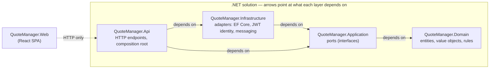

# Warehouse Anywhere — Quote Manager

A service-request and quote management tool modelled on Warehouse Anywhere's actual business:
client companies that need somewhere to store goods (and get them packed and moved) submit a
**request**, and a partner network of storage facilities, packing vendors, and carriers respond
with **quotes**. A reviewer takes each quote through a review lifecycle and accepts exactly one
per request.

Stack: ASP.NET Core 10 (minimal APIs) + EF Core/SQLite on the backend, React 19 + Vite + Tailwind
CSS v4 + shadcn/ui on the frontend, JWT bearer authentication, and a modular-monolith/ports-and-
adapters architecture (Domain → Application → Infrastructure/Api, dependencies only pointing
inward).

---


## Documentation

This README covers getting the project running locally. Deeper topics live in `docs/`:


| Doc                                        | Covers                                                                                                               |
| ------------------------------------------ | -------------------------------------------------------------------------------------------------------------------- |
| [User Roles](docs/user-roles.md)           | The four roles, what each can do, and how role-based authorization is wired end to end.                              |
| [API Endpoints](docs/api.md)               | Every `/api` route — auth, request/response shapes, errors, and the business logic behind each.                      |
| [Security Overview](docs/security.md)      | A single, high-level tour of how the app is secured — authentication, authorization, IDOR protections, CSP, secrets. |
| [Database Schema](docs/database-schema.md) | Every table, its columns and indexes, relationships, and the migration history.                                      |


---


## Architecture

`src/` holds five projects — four backend layers in a ports-and-adapters (hexagonal) arrangement,
plus the frontend sitting entirely outside that dependency graph:




| Folder                        | Depends on                       | What it is                                                                                                                                                                                            |
| ----------------------------- | -------------------------------- | ----------------------------------------------------------------------------------------------------------------------------------------------------------------------------------------------------- |
| `QuoteManager.Domain`         | *nothing*                        | Business entities, value objects, and the rules that govern state (e.g. quote transitions). No project references, no NuGet packages — it stays plain C#, testable with no host running.              |
| `QuoteManager.Application`    | `Domain`                         | Declares the ports (`ICurrentUser`, `IIntegrationEventPublisher`) and cross-cutting contracts the domain needs but shouldn't implement itself — no framework or cloud package is allowed here either. |
| `QuoteManager.Infrastructure` | `Application`                    | Implements those ports: EF Core/SQLite persistence, JWT-claims-based identity, and Service-Bus-or-in-process messaging. Swapping any of these out never touches `Domain` or `Application`.            |
| `QuoteManager.Api`            | `Application` + `Infrastructure` | The composition root: HTTP endpoints, auth, error handling, DI wiring — and it also serves the built SPA's static files. The only project allowed to know about both a port and its concrete adapter. |
| `QuoteManager.Web`            | *(none of the above)*            | A separate React/Vite project with no project reference into the .NET solution at all — it talks to `Api` purely over HTTP, the same way any external client would.                                   |


The ordering is the point: dependencies only ever point inward, so a business rule in `Domain`
never depends on a technical decision (which database, which web framework, which cloud provider).
This isn't just convention — `tests/QuoteManager.Architecture.Tests/DependencyRuleTests.cs` reads
every `.csproj` directly and fails the build if `Domain` gains any reference, if `Application`
references anything but `Domain`, if `Infrastructure` references anything but `Application`, or if
anything at all references `Api`.

---


## Project Setup


### Prerequisites


| Tool     | Version           | Notes                                                                                                                |
| -------- | ----------------- | -------------------------------------------------------------------------------------------------------------------- |
| .NET SDK | 10.0.100+         | Pinned via `global.json` (`rollForward: latestMinor`), so any 10.x SDK works.                                        |
| Node.js  | 22.x              | `react-router` 7.18.1 is used specifically because it has no Node-version floor above 20; any current Node 22 works. |
| npm      | bundled with Node | No separate install needed.                                                                                          |


No database server, Docker, or cloud account is required. Persistence is a single SQLite file
created automatically on first run; Azure integrations (Application Insights, Service Bus) are
present in the code but are **configuration-gated** — absent config, they're simply not used.

### Clone and restore

```bash
git clone <repo-url>
cd WA_QuoteManager
dotnet restore
dotnet tool restore
```

`dotnet tool restore` installs the local `dotnet-ef` CLI tool (pinned in
`.config/dotnet-tools.json`). You only need it if you intend to add a new EF Core migration by
hand — the app applies existing migrations itself at startup.

### Run it — fastest path (single process, one command)

```bash
dotnet run -c Release --project src/QuoteManager.Api
```

This one command:

1. Runs `npm ci && npm run build` for the React app (an MSBuild target wired into
  `QuoteManager.Api.csproj`, Release-only) and copies the built assets into `wwwroot`.
2. Applies any pending EF Core migrations to a local `quotemanager.db` SQLite file (created if it
  doesn't exist).
3. Seeds demo data on an empty database (idempotent — running again is a no-op once data exists),
  including five organizations with profile data (addresses, contacts, location lists, and
  preferred-vendor flags).
4. Serves the API and the SPA from the same origin: **[http://localhost:5080](http://localhost:5080)**.


### Run it — development mode (hot reload)

Two terminals:

```bash
# Terminal 1 — API on http://localhost:5080
dotnet run --project src/QuoteManager.Api
```

```bash
# Terminal 2 — Vite dev server on http://localhost:5173, proxies /api and /health to :5080
cd src/QuoteManager.Web
npm install
npm run dev
```

Open **[http://localhost:5173](http://localhost:5173)**. The browser only ever talks to one origin; Vite's dev proxy
forwards API calls to the backend, so there's no CORS configuration anywhere in the app.

### Demo credentials

The seeded database includes one account per role, all sharing the password below:


| Email                              | Role      | Organization                      |
| ---------------------------------- | --------- | --------------------------------- |
| `admin@warehouseanywhere.test`     | Admin     | — (platform staff)                |
| `requester@warehouseanywhere.test` | Requester | Meridian Pharma Sampling (client) |
| `reviewer@warehouseanywhere.test`  | Reviewer  | Palmetto Retail & CPG (client)    |
| `vendor@warehouseanywhere.test`    | Vendor    | SecureBase Self Storage           |
| `vendor2@warehouseanywhere.test`   | Vendor    | Crateworks Packing & Crating      |
| `vendor3@warehouseanywhere.test`   | Vendor    | Interstate Freight Partners       |


**Password (all accounts):** `Demo!2345`

This password is deliberately not secret — it's published here on purpose, and the seed hashes it
the same way a real signup would. Each account also has a seeded address and phone number, and can
be edited (including changing this password) from the Users screen — see
[Users](docs/api.md#users) in the API docs.

### Configuration

Defaults live in `src/QuoteManager.Api/appsettings.json` and need no changes to run locally:


| Setting                          | Default                                | Purpose                                                                                                                                                                              |
| -------------------------------- | -------------------------------------- | ------------------------------------------------------------------------------------------------------------------------------------------------------------------------------------ |
| `ConnectionStrings:QuoteManager` | `Data Source=quotemanager.db`          | SQLite file path (gitignored, created on first run).                                                                                                                                 |
| `Jwt:SigningKey`                 | a committed demo key                   | HS256 signing key for bearer tokens. **Not fit for production** — swap it via environment variable / user secrets before deploying anywhere real.                                    |
| `Jwt:Issuer` / `Jwt:Audience`    | `QuoteManager` / `QuoteManager.Client` | Token validation parameters.                                                                                                                                                         |
| `AzureMonitor:ConnectionString`  | unset                                  | If present, OpenTelemetry exports to Azure Monitor. Absent by default — telemetry still works locally via the console/OTel pipeline.                                                 |
| `ServiceBus:ConnectionString`    | unset                                  | If present, integration events publish to Azure Service Bus. Absent by default — an in-process channel adapter is used instead, so outbox/messaging works with zero cloud setup.     |
| `KeyVault:Uri`                   | unset                                  | If present, secrets are additionally loaded from Azure Key Vault (see below). Absent by default — everything above reads from `appsettings.json` / user secrets / env vars as usual. |


#### Secrets: Azure Key Vault (optional)

`Jwt:SigningKey` is the one setting above that's a real secret rather than a connection detail, and
the committed value is explicitly a demo placeholder. `Program.cs` wires up the same "adapter only
activates when configured" pattern already used for Azure Monitor and Service Bus above: if
`KeyVault:Uri` is set, `builder.Configuration.AddAzureKeyVault(...)` layers the vault's secrets on
top of the existing configuration, and a same-named secret there overrides the local value; if it's
unset (the default), the call is skipped entirely and configuration works exactly as it does today.

```json
{
  "KeyVault": { "Uri": "https://your-vault-name.vault.azure.net/" }
}
```

- Authentication uses `DefaultAzureCredential` — a managed identity when running in Azure, or the
logged-in `az`/Visual Studio/VS Code credential for local development against a real vault. No
vault secret or connection string is ever hardcoded to reach it.
- Key Vault secret names can't contain `:`, so nested keys use `--` instead — the signing key above
would be stored as a secret literally named `Jwt--SigningKey`.
- **This repository has no Azure subscription to point at**, so only the *absent* path — the actual
default, exercised by every test in the suite — is verified end to end. The *present* path is
scaffolding: it follows the standard, documented `Azure.Extensions.AspNetCore.Configuration.Secrets`
integration and is straightforward to verify against a real vault, but that verification hasn't
been (and can't be) done here.


### Running the tests

```bash
dotnet build -warnaserror   # matches CI: zero warnings tolerated
dotnet test                 # Domain, Architecture (dependency-direction rules), Infrastructure, API integration
```

Frontend:

```bash
cd src/QuoteManager.Web
npm run build   # tsc -b && vite build
npm run lint    # oxlint
```

End-to-end (Playwright, spins up both the real API and the Vite dev server itself):

```bash
cd tests/QuoteManager.Web.E2ETests
npm install
npx playwright install chromium   # first time only
npx playwright test
```

