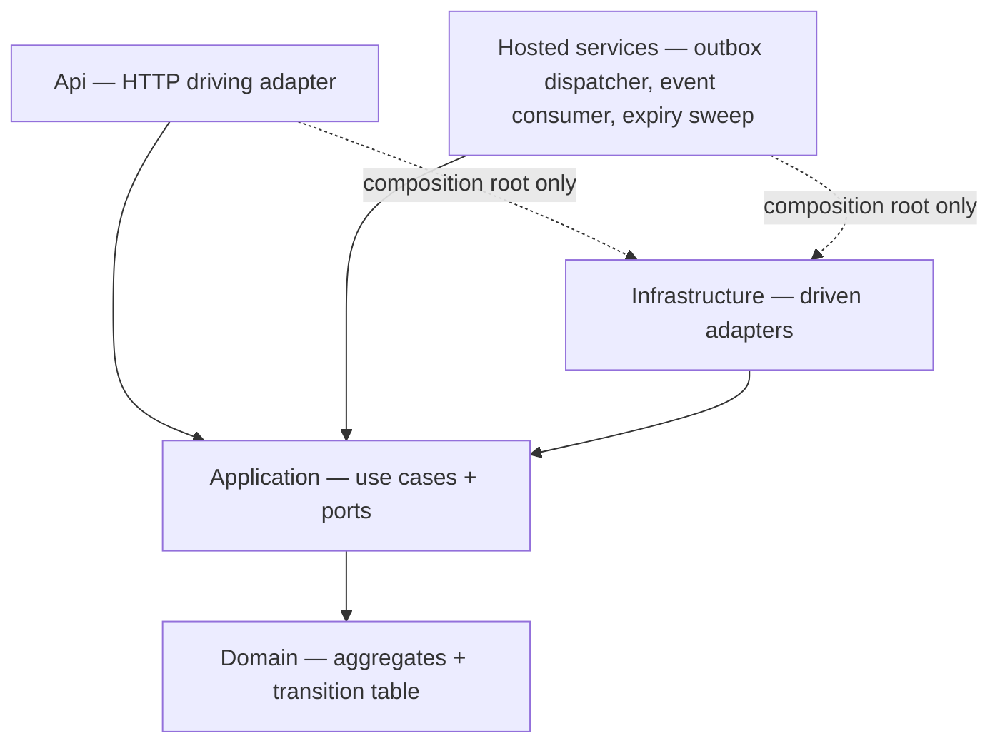
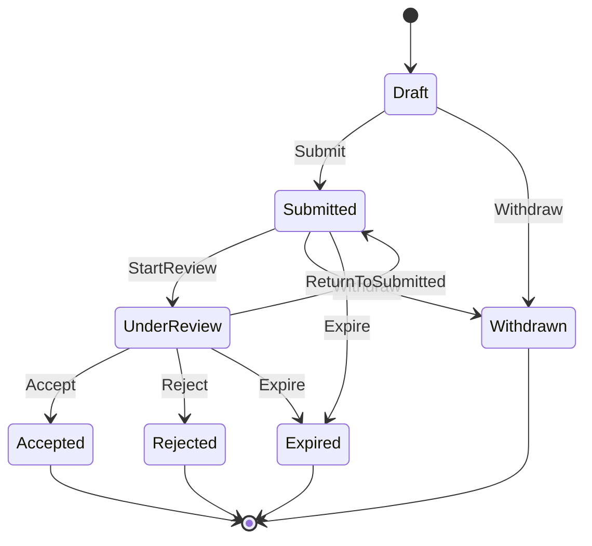
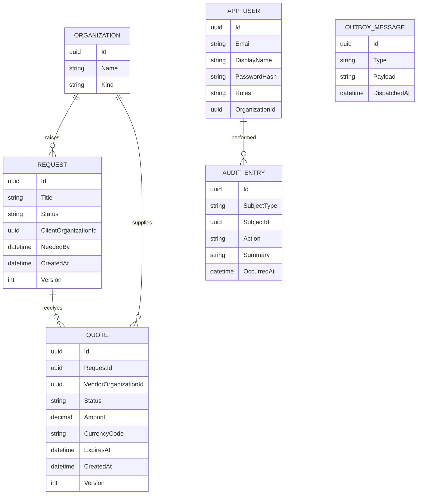
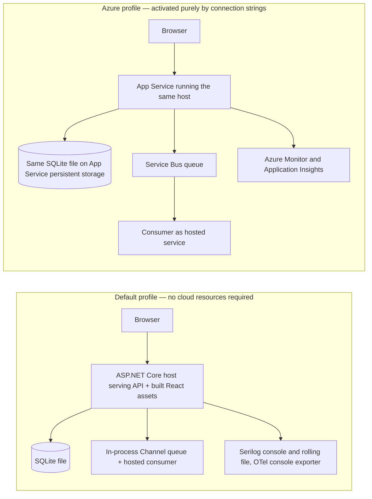

# Architecture Spine — QuoteManager

## Design Paradigm

Modular monolith with **ports and adapters**. One deployable ASP.NET Core host; four projects with an inward-only dependency rule.

| Layer | Project | Owns |
| --- | --- | --- |
| Domain | `QuoteManager.Domain` | Aggregates, the quote transition table, domain events, typed domain exceptions |
| Application | `QuoteManager.Application` | Use-case handlers, outbound **ports**, read-model projections |
| Infrastructure | `QuoteManager.Infrastructure` | Driven adapters — EF Core, outbox dispatcher, messaging, telemetry, clock |
| Api | `QuoteManager.Api` | Driving adapter — HTTP endpoints, auth, error mapping, composition root, hosted services |



The dotted edges are the only permitted outward references, and only from `Program.cs` and the `DependencyInjection` registration files. Everything else resolves ports through the container.

## Invariants & Rules

### AD-1 — Inward-only dependency direction, enforced by package references

- **Binds:** all
- **Prevents:** Domain and Application acquiring framework dependencies, which would make the core untestable and would weld the persistence and messaging choices into the business rules
- **Rule:** `Domain` references no other project and no third-party package. `Application` references only `Domain`, and declares every outbound capability as an interface in `Application/Abstractions`. `Infrastructure` and `Api` reference inward only; nothing references `Api`. No `Microsoft.EntityFrameworkCore.*`, `Microsoft.AspNetCore.*`, `Microsoft.Data.*`, `Azure.*`, `Serilog*`, or `Scalar*` package reference may appear in `Domain` or `Application`. `QuoteManager.Architecture.Tests` asserts this by parsing the **project files**, not the compiled assemblies — Roslyn omits references no code has used yet, so an assembly-level check passes vacuously on a thin project and cannot see a package that was added but not yet called.

### AD-2 — One declarative transition table is the sole authority on the quote lifecycle

- **Binds:** FR-2, FR-3, every quote mutation path
- **Prevents:** transition rules being re-implemented per endpoint or per screen, and the set of transitions the UI offers drifting from the set the API will accept
- **Rule:** A single static table lives in `Domain` and is the only place a legal transition is expressed. It maps `(QuoteStatus, QuoteAction)` to a resulting `QuoteStatus` **and the roles permitted to invoke it** — the role axis lives in the table, not in endpoint attributes, because AD-7 promises an actor-aware action set and two sources of truth for "who may do this" is exactly the drift AD-2 exists to prevent. The Domain exposes exactly one function, `QuoteTransitions.PermittedFor(status, actorRoles)`, and **both** the endpoint's authorisation check and the AD-7 projection call it. No `Roles = "..."` string literal may appear on a transition endpoint. All mutation flows through `Request.ApplyQuoteAction(quoteId, action, actor, occurredAt)`. The HTTP surface exposes **one** action-driven transition endpoint per quote, never a verb-per-status family of endpoints. An action absent from the table is rejected as a domain violation, never silently ignored.
- **Rule (field mutability):** AD-2 governs data changes as well as status changes, because an amount that stays editable after submission makes the whole review lifecycle meaningless. A quote's business fields are mutable only in `Draft`; a request's only while it has no submitted quotes. Every other edit is rejected as a domain violation with code `quote.not_editable` or `request.not_editable`. **Nothing is ever hard-deleted** — removal is expressed as a lifecycle action (`Withdraw`) so the audit trail stays complete.
- **Status:** the transition endpoint is implemented — `POST /api/requests/{requestId}/quotes/{quoteId}/actions` calls `Request.ApplyQuoteAction` with no role literal anywhere in `Api/Quotes/QuoteEndpoints.cs`. Field-mutability editing (`EditQuote`/`request.Update`) has no endpoint yet.



`Accept` and `Reject` are reachable only from `UnderReview`. Attempting to accept a `Submitted` quote is a real rejection the demo exercises deliberately, not an oversight.

### AD-3 — At most one accepted quote per request, guarded in the aggregate and again at the database

- **Binds:** FR-3
- **Prevents:** two concurrent accept requests each passing an in-memory check and both committing, leaving a request with two accepted quotes and no way to tell which one won
- **Rule:** `Request` is the aggregate root and owns its quotes, so acceptance is a single consistency boundary. `Request.ApplyQuoteAction` refuses `Accept` when any sibling is already `Accepted`. Independently, a filtered unique index on `Quotes(RequestId)` restricted to rows where `Status = 'Accepted'` exists in the schema.
- **Rule (the index must actually bite, and cannot be assumed to):** `QuoteStatus` is persisted **as text** via an explicit value converter, never as EF's default ordinal `int`. The filter is written with SQLite's double-quoted identifiers — `HasFilter("\"Status\" = 'Accepted'")` — not the bracket syntax the EF Core documentation shows for SQL Server. This is pinned here rather than left to the persistence story because the failure is invisible: map the enum to `int` and the filter matches zero rows forever, the database-level guarantee silently disappears, and **every test still passes** because the aggregate check catches the ordinary case first. The protection is therefore a test that bypasses the aggregate entirely and attempts to insert a second accepted row through raw SQL or a second `DbContext`, asserting the store itself refuses. Without that test the second half of "guarded in the aggregate and again at the database" is unverified decoration. Accepting also transitions every sibling in `Submitted` or `UnderReview` to `Rejected` with reason `SupersededByAcceptedQuote`, and sets the parent `Request` to `Awarded`, **all inside one transaction**. A unique-index violation surfaces as HTTP 409 with code `quote.already_accepted`, never as a 500.

### AD-4 — A transactional outbox is the only path by which anything leaves the process

- **Binds:** all domain events, all messaging
- **Prevents:** external side effects diverging from committed state — a notification lost because the process crashed between commit and send, or a phantom effect fired for a transaction that then rolled back. It guarantees that effects outside the consistency boundary happen exactly when, and only when, the state change committed. (It is explicitly *not* what makes the audit trail trustworthy; AD-5's audit is a transactional projection that does not depend on the outbox at all.)
- **Rule:** Use-case handlers never call a broker. Aggregates raise domain events; a `SaveChangesAsync` interceptor writes **all** of them to `AuditEntry` per AD-5, and writes to `OutboxMessages` **only** those events named in an explicit integration-event allow-list living in one file in `Application`. A domain event absent from that list never leaves the process — the queue carries out-of-boundary integration events, not an undifferentiated firehose of internal state changes. Integration-event payloads are versioned contracts and never expose Domain types directly. One `OutboxDispatcher` hosted service claims unsent rows in insertion order and hands each to the `IIntegrationEventPublisher` port, marking them dispatched only on success. Delivery is therefore **at-least-once**, so every consumer must be idempotent keyed on `OutboxMessage.Id`.
- **Status:** implemented. `DomainEventPersistenceInterceptor : SaveChangesInterceptor` (`Infrastructure/Persistence/Auditing`, the same interceptor AD-5 depends on — see its Status note for why the two are one class rather than two) additionally resolves each domain event against `IntegrationEventAllowList.Resolve` (`Application/Messaging`) and, for a match, appends an `OutboxMessage` carrying the versioned contract's own `ContractName` and its JSON payload. The allow-list currently covers `RequestCreated`, `VendorInvited`, `RequestAwarded`, `RequestCancelled`, and `QuoteStatusChanged` filtered to `To == Accepted` (as `QuoteAccepted.v1` — the one transition among several the type carries that is genuinely an integration-worthy event). `OutboxDispatcher` (`Infrastructure/Messaging`, a `BackgroundService`) polls every two seconds, claims undispatched rows ordered by `Id` (UUIDv7's own monotonic-by-creation guarantee, so no separate sequence column is needed — see AD-5's Status note for why the interceptor has to mint each id carefully to keep that guarantee true within one save), and calls `IIntegrationEventPublisher.PublishAsync` once per message, saving after each so a mid-batch failure never re-sends an already-successful sibling. `OutboxWritingTests` asserts the seed's exact allow-listed counts (6 `RequestCreated.v1`, 12 `VendorInvited.v1`, one each of `QuoteAccepted.v1`/`RequestAwarded.v1`, zero `Organization*` of any kind) and that every row reaches `DispatchedAt` within the dispatcher's own poll interval.

### AD-5 — Audit is a transactional projection of domain events; diagnostic logging is not audit

- **Binds:** FR-5, FR-4
- **Prevents:** the audit trail disagreeing with committed state, and "what happened" being scattered across controllers where each endpoint decides for itself what is worth recording
- **Rule:** Every state-changing operation appends `AuditEntry` rows **in the same transaction** as the change, derived from the same domain events that feed the outbox — so audit cannot be skipped by a code path that forgets to log. Actor identity comes from the authenticated principal only. Serilog and OpenTelemetry output are diagnostics and are explicitly **not** the audit source of truth; audit queries never read log files. The per-request activity timeline that satisfies FR-4 reads `AuditEntry` directly.
- **Status:** implemented as `DomainEventPersistenceInterceptor : SaveChangesInterceptor` (`Infrastructure/Persistence/Auditing`), attached to every `QuoteManagerDbContext`. Scans `ChangeTracker.Entries<AggregateRoot>()` for pending domain events inside `SavingChangesAsync`, so the extra inserts land in the same batch as the change. Actor display names resolve correctly for the `DomainActor.System` sentinel, for `AppUser` rows created earlier in the *same* save (the seeder's own accounts), and for existing users. `AuditTests` verifies both the full seed run and a live API-driven transition. Originally named `AuditInterceptor`; renamed once it also became the one place AD-4's outbox write happens — deliberately the same class rather than two independently registered interceptors racing to be the one that clears `AggregateRoot.DomainEvents` first (see AD-4's Status note). `GET /api/requests/{requestId}/activity` (`RequestActivityEndpoints`) is the FR-4 timeline reader named in the Rule above: it unions `AuditEntry` rows whose subject is the request itself or one of its quotes, applies the identical Vendor-only read filter `RequestEndpoints.GetRequestAsync` already applies to the quotes/invitations lists (`RequestEndpoints.IsVendorOnlyView`, `internal` specifically so this endpoint can reuse it rather than re-deriving the same rule), and paginates via `PagedListQuery`. Minting each `AuditEntry`/`OutboxMessage` id from a fresh `timeProvider.GetUtcNow()` per event turned out not to actually satisfy the "UUIDv7 sorts by creation order" guarantee AD-4 leans on: `Request.ApplyQuoteAction(Accept, ...)` raises an Accept, a Reject per superseded sibling, and a RequestAwarded from one call sharing one `DateTimeOffset`, and `Guid.CreateVersion7` only encodes millisecond resolution (RFC 9562's `unix_ts_ms`) — a real-clock burst inside that granularity ties or reorders on its remaining random bits, which the timeline endpoint's `OrderByDescending(OccurredAt).ThenByDescending(Id)` surfaced immediately (`RequestAwarded` sorting behind a `QuoteRejected` it caused). Fixed at the source: the interceptor now captures one `timeProvider.GetUtcNow()` per `SaveChangesAsync` call and mints every id in that call from `idClock.AddMilliseconds(offset++)`, so ids raised together are strictly increasing regardless of real clock resolution. `RequestActivityEndpointTests` covers the admin full-history view (asserting `RequestAwarded` sorts first, the case that caught this), the vendor-filtered view, the silent-invitee view (no `Quote`-subject rows at all), and the 404.

### AD-6 — Messaging has a local default adapter and a configuration-gated Azure adapter; persistence does not

- **Binds:** messaging and telemetry only
- **Prevents:** the demo path and the deployed path being different code, and a missing or unreachable cloud resource turning into a start-up crash
- **Rule:** **`IIntegrationEventPublisher` is the one port with two adapters** — an in-process channel adapter used by default and an Azure Service Bus adapter selected **only** when its connection string is present. Telemetry is not a second adapter pair but an OpenTelemetry exporter swap on the same pipeline, gated the same way. Selection happens in one composition-root file, never scattered across registrations. The absence of a connection string is a supported, tested configuration — not an exception.
- **Rule (persistence is explicitly excluded):** persistence has **exactly one** provider in this build, SQLite. Substituting SQL Server is a migration-set problem, not an adapter problem, and is named under Deferred. A story author must not build a second persistence adapter.
- **Rule (verification, executable without a subscription):** the port's contract test suite runs against the local adapter in CI. The Service Bus adapter is compile-verified and covered by a contract test carrying `[Trait("Requires","Azure")]` that is excluded from the default run. The part that actually carries risk — adapter selection — is covered by a configuration test asserting that an absent connection string resolves the local adapter and a present one resolves the Azure adapter. Because the Azure subscription is inactive by stated constraint, a rule demanding live cloud verification would simply be ignored, which is the worst possible fate for a spine rule.
- **Status:** implemented. `Infrastructure/DependencyInjection.AddMessaging` is the one composition-root method: an absent `ServiceBus:ConnectionString` registers `InProcessIntegrationEventPublisher` (an unbounded `Channel<IntegrationEventEnvelope>`, per AD-6's own local-adapter framing) plus `InProcessIntegrationEventLogger`, a `BackgroundService` standing in as the local consumer so the default path is a working queue with a reader rather than a publish call into nothing; a present one registers a singleton `ServiceBusClient`/`ServiceBusSender` pair and `ServiceBusIntegrationEventPublisher`, which stamps `ServiceBusMessage.MessageId` from the outbox row's own id (Service Bus duplicate-detection keys on exactly this field) and `Subject` with the versioned contract name. `IntegrationEventPublisherSelectionTests` (`QuoteManager.Infrastructure.Tests`, a new project — no prior test project could reach the composition root in isolation) proves both branches resolve the right concrete type without a live namespace; `InProcessIntegrationEventPublisherTests` is the always-on local contract test; `ServiceBusIntegrationEventPublisherTests` carries `[Trait("Requires","Azure")]` and calls `Assert.Skip` when `QUOTEMANAGER_SERVICEBUS_CONNECTION_STRING` is unset, which is every CI run today. Telemetry's exporter swap (Azure Monitor OpenTelemetry Distro, gated on `AzureMonitor:ConnectionString`) predates this work and is unchanged.

### AD-7 — The client encodes no domain rules; the server projects the permitted action set

- **Binds:** the entire React application, every quote and request response
- **Prevents:** the UI offering an action the API will reject, or hiding a legal one — the single most likely divergence between the two halves of this build, and the one the brief explicitly tests
- **Rule:** Every quote representation crossing the wire carries `permittedActions`, computed server-side by `QuoteTransitions.PermittedFor` (AD-2) for the current actor's roles and the current state. UI controls are rendered by mapping over that array. No TypeScript may branch on `status` **or on role** to decide what a user may do, and the lifecycle table is never duplicated client-side. Client-side validation is confined to shape and format; every business rule is server-verified.
- **Rule (non-transition capabilities travel the same channel):** `permittedActions` also carries the capabilities that are not status transitions — `Edit`, `AddQuote` — derived from AD-2's mutability rule. Without this the frontend has nothing to render an edit control from and a developer is pushed straight back into the `status`-branching this AD forbids, so the single source of truth has to cover every action the UI can offer, not just lifecycle ones.
- **Status:** `QuoteResponse.PermittedActions` is implemented for quotes, computed via `QuoteTransitions.PermittedFor` - `Edit` falls out of the table's `Draft→Edit→Draft` self-transition for free. `AddQuote`'s request-level counterpart is `RequestDetailResponse.CanAddQuote` — a single boolean rather than a list, since exactly one request-level capability exists today. It is `true` only for the Vendor self-serve path (the viewer holds the Vendor role, has an organisation id, the request is still `IsEditable`, and that organisation has no quote on it yet); Admin can still call `POST /api/requests/{id}/quotes` on behalf of any vendor, but that is a support action with no dedicated screen, so the field deliberately does not need to carry it. Computed identically on `GET /api/requests/{id}` and immediately after `POST /api/requests` so a client never has to special-case a freshly created request.

### AD-8 — Errors cross the boundary as RFC 9457 problem details with a stable machine code

- **Binds:** every endpoint, all UI error handling
- **Prevents:** each endpoint inventing its own error envelope, and the UI string-matching human-readable messages that then break when the wording changes
- **Rule:** One exception-handling middleware maps typed domain exceptions to `ProblemDetails` carrying `type`, `title`, `status`, `detail`, a `code` extension drawn from a closed set of stable identifiers, and the active OpenTelemetry `traceId`. Domain rule violations map to 409, validation failures to 400 with per-field errors, authorisation failures to 403. Controllers and endpoint handlers contain no `try`/`catch` for domain violations. The UI branches on `code` only.
- **Rule (shape/format validation is separate from domain validation, and lives with the input):** every bound input type — request body or query string — lives in `Api/Models`, one type per file, and implements `IValidatableObject`. There is no exception carved out for query-bound types: `PagedListQuery` lives there too, bound via `[AsParameters]` rather than as loose scalar endpoint parameters. `Program.cs` calls `builder.Services.AddValidation()` (.NET 10's minimal API validation, driven by a source-generated interceptor — see `InterceptorsNamespaces` in `QuoteManager.Api.csproj`), which runs DataAnnotations attributes and then `Validate()` during model binding, before a handler body ever executes. A failure short-circuits to a 400 with per-field errors on its own; it never reaches `DomainExceptionHandler`. `Validate()` exists for restrictions an attribute cannot express alone (cross-field rules, or gaps in an attribute's own contract — e.g. `[EmailAddress]` does not anchor to the string's edges, so it accepts a leading/trailing space; or a rule that would fight a type's own defaulting, such as clamping, if expressed as an attribute).
- **Rule (an endpoint with no client-supplied input needs no model):** this is deliberately not "every endpoint has an `Api/Models` type" — `GET /api/dashboard` takes none, because every bucket it returns is derived from the authenticated actor and the server clock, not from anything the caller supplies. Manufacturing an empty model there would be ceremony, not validation.
- **Status:** implemented. `DomainExceptionHandler : IExceptionHandler` (`Api/ErrorHandling`) is registered ahead of the generic `AddProblemDetails()` handler and covers domain/concurrency violations as below. Shape validation covers `LoginRequest` (required fields, email format, no whitespace-padding), `ApplyQuoteActionRequest` (`Action` must be a defined `QuoteAction` — closes a real gap, since `JsonStringEnumConverter` still accepts a bare out-of-range integer on deserialisation), and `PagedListQuery` (`page`/`pageSize` — absent defaults, `pageSize` clamped above 100, an explicit non-positive value on either rejected as 400 rather than silently reinterpreted). `PagedListQuery` replaced the earlier hand-rolled `PagedQuery`/`int? page, int? pageSize` workaround once its properties were made nullable, which is what the original `[AsParameters]` binder bug (AD-11's status log) actually turned on — the bug was the non-nullable properties, not `[AsParameters]` itself. Verified by `AnonymousEndpointsTests`, `QuoteTransitionTests`, `RequestsEndpointTests`, and `OrganizationsEndpointTests`, which assert the 400 and the named field rather than trusting the wiring. FluentValidation was referenced early but never used by any endpoint; removed rather than left as dead weight once minimal API's built-in validation covered the same need with less machinery.

### AD-9 — Stateless JWT bearer authentication with a deny-by-default authorisation fallback

- **Binds:** every endpoint, FR-5 actor capture
- **Prevents:** a mix of auth schemes appearing as the app grows, and a newly added endpoint shipping unprotected because nobody remembered the attribute
- **Rule:** Exactly one authentication scheme: JWT bearer, HS256, signed with a key from configuration. A fallback authorisation policy requires an authenticated user for **every** endpoint, so protection is the default and anonymity is opt-in. Password hashing uses the ASP.NET Core Identity `PasswordHasher`, never a hand-rolled scheme. Refresh tokens and revocation are deliberately out of scope for this build and named under Deferred.
- **Rule (the complete anonymous set, enumerated):** a fallback policy applies to every *endpoint*, and `MapFallbackToFile("index.html")` is an endpoint — so a naive "login and health only" enumeration returns 401 for `/` and `/login` and the demo cannot start at all. Exactly these are anonymous, and nothing else: the login endpoint, the health endpoints, **the SPA fallback route and its static assets**, **the OpenAPI document**, and **the Scalar reference UI**. The last two matter because a reviewer from a fresh clone is most likely to open the API reference first. Enforcement is a test, not this prose: an integration test asserts unauthenticated `GET /`, `GET /login`, `GET /health`, and `GET /openapi/v1.json` all return 200 while a representative API route returns 401.
- **Status:** implemented. `Program.cs` wires `AddJwtBearer` plus `AddAuthorizationBuilder().SetFallbackPolicy(RequireAuthenticatedUser)`; `/`, `/health`, `/openapi/v1.json`, and Scalar carry explicit `AllowAnonymous()`. Verified by `AnonymousEndpointsTests`, which hosts the real pipeline via `WebApplicationFactory<Program>` and asserts the anonymous set plus a 401 on `/api/auth/me`.

### AD-10 — Actor identity comes only from the authenticated principal

- **Binds:** FR-5, every write path
- **Prevents:** a caller attributing an action to another user by putting an actor field in the request body, which would make the whole audit trail inadmissible
- **Rule:** A single `ICurrentUser` port exposes the acting user id, display name, and roles, implemented over `HttpContext.User`. No request DTO may contain an actor, author, or user field; any such field is dropped rather than trusted. Background work that has no HTTP principal supplies an explicit system actor, so an audit row always has a resolvable origin.
- **Status:** implemented. The port lives at `Application/Abstractions/ICurrentUser.cs`; `Infrastructure/Identity/CurrentUser.cs` reads it off `HttpContext.User` via `IHttpContextAccessor`. Not yet exercised by a write path, since no command handlers exist yet — that lands with the transition endpoint.

### AD-11 — Read models for the work-triage views are dedicated projections, never serialised aggregates

- **Binds:** FR-4
- **Prevents:** the dashboard fanning out into per-row queries as it grows, and presentation concerns leaking back into Domain to make serialisation convenient
- **Rule:** Every list and dashboard endpoint returns a purpose-built DTO produced by a single projected `AsNoTracking` query that selects straight into that DTO. Aggregates are never returned from a controller. Attention signals — quote age, request staleness, proximity to expiry, awaiting-review counts — are computed in the projection or from stored columns, against the injected `TimeProvider` and never `DateTime.Now`, so every signal is deterministic under test.
- **Status:** implemented. `GET /api/dashboard` (`Api/Dashboard`) returns four triage buckets — needs review, under review, expiring within 3 days, requests with a silent invitee — each an `AsNoTracking` join across Quotes/Requests/Organizations (no navigation property connects them; see AD-3's note on why), with `permittedActions` attached after materialising since `QuoteTransitions.PermittedFor` cannot translate to SQL. It takes no client-supplied input at all — every bucket is derived from the authenticated actor and the server clock — so it has no `Api/Models` type and needs none. `GET /api/requests` (list + detail) and `GET /api/organizations` back the drill-through and both follow the list-query convention (`PagedListQuery`/`PagedResult<T>`, page 1-based, pageSize clamped to 100). `DashboardTests`, `RequestsEndpointTests`, and `OrganizationsEndpointTests` assert the buckets and projections against the seed's known scenarios rather than just asserting 200 OK.

### AD-12 — Every package version is centrally managed, and known-vulnerable transitives are pinned

- **Binds:** every project in the solution, CI
- **Prevents:** two projects resolving different versions of the same package, and a known-vulnerable transitive dependency shipping because nobody read the restore warnings
- **Rule:** `ManagePackageVersionsCentrally` is on; no `PackageReference` may carry an inline `Version` attribute, and an architecture test fails the build if one appears. `CentralPackageTransitivePinningEnabled` is on so a vulnerable transitive can be raised without making it a direct reference, and every such pin carries a comment naming its advisory and the condition for removing it. CI builds with `-warnaserror`, which promotes NuGet audit findings (`NU1903`) to build failures — so an unpatched advisory cannot merge. Two are pinned today: `Microsoft.OpenApi` to 2.7.5 and `SQLitePCLRaw.lib.e_sqlite3` to 2.1.12, both dragged in by the .NET templates and EF Core respectively.

### AD-13 — Roles are a closed set; write authorisation and quote/invitation read visibility are both organisation-scoped for Vendor

- **Binds:** AD-2, AD-7, every endpoint
- **Prevents:** the endpoint story expressing authorisation as `[Authorize(Roles = ...)]` while the projection story computes `permittedActions` from status alone — which makes the UI offer actions the API answers with 403: the same class of failure AD-7 exists to prevent, merely with a different status code. Also prevents the read side undoing what the write side protects: a Vendor who cannot act on a competitor's quote must not be able to read its amount either, or the ownership boundary is theatre.
- **Rule:** Four roles, closed: `Admin` (everything), `Requester` (creates and manages requests for a client organisation), `Reviewer` (may `StartReview`, `Accept`, `Reject`, `ReturnToSubmitted`), `Vendor` (may create, submit, and `Withdraw` quotes belonging to its own organisation). `Organization.Kind` distinguishes client from vendor, so the two roles one entity plays are explicit in the schema rather than inferred. Roles are claims on the JWT and are the only authorisation input, per AD-10.
- **Rule (row-level read posture, stated precisely rather than as a blanket "everyone sees everything"):** `GET /api/requests` (list), `GET /api/organizations`, and `GET /api/dashboard` are unfiltered — every authenticated role sees every request, organisation, and triage bucket, and this remains a deliberate scope decision stated in the README and demo script. The one place this does **not** hold is `GET /api/requests/{id}`'s `quotes`/`invitations` detail: a pure `Vendor` account (no `Admin`/`Reviewer`/`Requester` role) sees only its own organisation's quote and its own invitation entry on that request, never a competitor's amount, notes, status, or even the fact that a competing quote exists. `Admin`/`Reviewer`/`Requester` — the client side of a request, which must compare every offer to do its job — see every quote and invitation, unfiltered. Write authorisation is unaffected either way — AD-2's role axis and this AD's ownership check already governed every mutation before this rule existed.
- **Status:** the closed role set, JWT role claims, and organisation ownership on Vendor-gated *actions* are implemented as before — enforced in `QuoteTransitions` via `DomainActor.OrganizationId` / `CanActForVendorOrganization`, and in `Request.AddQuote` so a Vendor cannot plant a draft under a competitor's organisation. Verified by domain tests and by an integration test where `vendor@` attempts to Withdraw `vendor2@`'s Submitted quote. The read-side half is now also implemented: `RequestEndpoints.GetRequestAsync` filters `Quotes`/`Invitations` through a private `IsVendorOnlyView` check before projecting to the response — deliberately not `actor.CanActForVendorOrganization`, since that method also returns `true` for `Admin` and is meaningless for `Reviewer`/`Requester` (whose `OrganizationId` is a *client* organisation, not a vendor one, so comparing it against a quote's vendor org would wrongly filter their view down to nothing). Verified by `RequestsEndpointTests`: a Vendor with a quote on a shared request sees only its own quote and invitation; a silent invitee Vendor sees its own invitation and zero quotes; the pre-existing Reviewer-sees-everything test is unchanged.
- **Status (client-side mirror, `Request.Create`):** raising a request was, until `POST /api/requests` existed, only ever called by the seeder — so the fact that `Request.Create` took a `DomainActor` parameter it never actually checked was invisible by coincidence, the same shape of gap this AD already found once on the vendor side. Closed the same way: `Request.Create` now throws `RequestCreationNotPermittedException` (403 via `DomainExceptionHandler`) unless the actor holds `Requester` or `Admin`. No `[Authorize(Roles = ...)]` at the endpoint — the same reasoning as every other write path in this AD. Verified by `RequestAggregateTests` (Vendor and Reviewer both refused) and `CreateRequestEndpointTests`.

### AD-14 — One `apiClient` is the only place the SPA originates a request or holds a token

- **Binds:** the entire React application
- **Prevents:** the highest-multiplicity gap available in this build — with one API client module per resource, every undecided auth question (where the token lives, how it is attached, what happens on 401) gets re-decided independently in every module
- **Rule:** `POST /api/auth/login` returns `{ accessToken, expiresAt, user: { id, displayName, roles } }`. Token lifetime is **8 hours** — long enough that expiry cannot interrupt a demo or a reviewer's evaluation, short enough to defend.
- **Rule (storage, with the trade-off stated):** the token is held in memory by one `AuthProvider` and rehydrated from `sessionStorage` so refreshing the page does not log the reviewer out. `sessionStorage` is readable by injected script, so this trades XSS exposure for demo usability; it is recorded here as a deliberate choice, and an `HttpOnly` cookie with CSRF protection is the production answer named under Deferred.
- **Rule (single egress):** exactly one `apiClient` wrapper attaches `Authorization: Bearer`, parses RFC 9457 problem details into a typed error, and is **the only place in the SPA where a network request originates**. Generated resource modules call it and never touch `fetch` or `axios` directly; this is lint-enforced via `no-restricted-globals` and `no-restricted-imports`, because a convention that only exists in prose is not a rule. On 401: clear auth state, clear the TanStack Query cache, redirect to `/login`. On 403: render a not-permitted state without logging out.
- **Status:** implemented end to end. Backend contract exactly as specified (plus `organizationId` on the user object and `GET /api/auth/me`, both additive). The SPA half is built on the already-scaffolded `QuoteManager.Web`: `src/api/apiClient.ts` is the sole fetch call in the codebase, `src/auth/authSession.ts` + `AuthProvider.tsx` hold the token in memory and rehydrate it from `sessionStorage`, and `.oxlintrc.json` carries `no-restricted-globals`/`no-restricted-imports` (with an override scoped to `apiClient.ts` itself) so the single-egress rule is enforced, not just documented. A Playwright suite (`tests/QuoteManager.Web.E2ETests`) covers login, a wrong-password message, and sign-out against the real API and dev server. One bug found only by running the real build in a browser: `UseStaticFiles` was positioned after `UseAuthentication`/`UseAuthorization` in `Program.cs`, so the fallback auth policy 401'd the SPA's own JS/CSS bundle before the static-file middleware ever got to serve it — fixed by moving static files ahead of the auth middleware. A second bug the browser surfaced: `apiClient` treated every 401 as "session expired" including the login endpoint's own 401 for bad credentials, masking `auth.invalid_credentials` behind a generic message — fixed by only triggering session invalidation when a session actually existed to invalidate.

### AD-15 — Every transition is concurrency-checked, not just Accept

- **Binds:** FR-3, AD-2, AD-3
- **Prevents:** two reviewers acting on the same `Submitted` quote both reading that status, both passing the transition table, and both committing — last write wins, and the audit trail then faithfully records two successful transitions out of one source state, which is visibly wrong in the exact artifact built to prove correctness
- **Rule:** AD-3 guards the `Accept` race specifically; that rigour has to be uniform rather than exceptional. `Quote` and `Request` each carry an `int Version` marked `IsConcurrencyToken()`, incremented inside `ApplyQuoteAction`. **SQLite has no `rowversion`**, so EF Core cannot supply this automatically and a story author reaching for `IsRowVersion()` will fail and improvise — hence an explicit integer token is named here. Quote reads return it as a weak `ETag`; the transition endpoint requires `If-Match`; `DbUpdateConcurrencyException` maps through AD-8 to 409 `quote.concurrent_modification`.
- **Status:** implemented for quotes. `GET`/`POST .../actions` round-trip a weak ETag built from `Quote.Version`; a missing or malformed `If-Match` is rejected as `quote.if_match_required` before any domain logic runs. Verified by `QuoteTransitionTests` (stale-ETag and missing-header cases) against the seeded demo data.

### AD-16 — Migrations are the only schema authority, and the seed makes the demo meaningful

- **Binds:** the fresh-clone run contract, FR-4
- **Prevents:** the two wrong turns that each independently defeat the hard "must run from a fresh clone" constraint — `EnsureCreated()`, which silently skips migration history and therefore never creates AD-3's filtered unique index, and an unseeded database, which leaves a reviewer staring at a login screen holding no valid credentials
- **Rule:** Migrations are committed to the repository and are the only schema authority; **`EnsureCreated` is banned**. `MigrateAsync` plus an idempotent seeder run at start-up, guarded to the Development and Demo environments. The SQLite file path is fixed and gitignored.
- **Rule (the seed is load-bearing, not decoration):** a triage dashboard over an empty database demonstrates nothing, so the seeder produces one user per AD-13 role with credentials documented in the README, two client organisations and two vendor organisations, and requests whose quotes occupy **every** lifecycle state — including one near expiry and one request carrying several competing quotes, so the AD-3 single-accepted invariant can be demonstrated live rather than described.
- **Rule (built through the aggregates):** the seeder constructs its graph by calling `Request.Create`, `AddQuote` and `ApplyQuoteAction` rather than inserting rows. Direct inserts can fabricate states the transition table would refuse, and a demo over impossible data is exercising a fiction. This also means the seed is a standing end-to-end test of the state machine: if a transition is broken, start-up fails loudly instead of the defect surfacing mid-demo.
- **Status:** implemented. Verified by `DemoSeedTests`, which asserts idempotency across a second run, coverage of every `QuoteStatus`, an account per role, and that the README's published password actually verifies against the stored hash.

### AD-17 — Timestamps are stored as fixed-width UTC text, because SQLite will not order them otherwise

- **Binds:** every date filter in the system, FR-4 most directly
- **Prevents:** discovering at UI-build time that the dashboard's central query cannot be written. EF Core's SQLite provider **refuses to translate ordering comparisons on `DateTimeOffset`** and throws at query-compile time; its default text form embeds the offset, so `2026-07-28 12:00:00+00:00` and `2026-07-28 08:00:00-04:00` are one instant that sorts as two. Left unaddressed this blocks "quotes expiring soon", which is the signal FR-4 exists to surface.
- **Rule:** a `UtcDateTimeOffsetConverter` normalises to UTC and writes `yyyy-MM-ddTHH:mm:ss.fffffffZ`, a form whose lexicographic order **is** its chronological order. Applied through `ConfigureConventions` over all `DateTimeOffset` properties rather than per property, so a timestamp added later cannot reintroduce the unsortable form on one column. Comparisons then translate to plain SQL and the index on `Quotes(Status, ExpiresAt)` serves range scans.
- **Rule (fixed width is not incidental):** fractional seconds are padded to seven digits. Without padding, `12:00:00.5` sorts before `12:00:00.45`, which is the same class of silent wrongness the offset causes.
- **Consequence:** hand-written SQL — migrations, seed scripts, tests — must emit this exact format. The converter parses strictly and throws on anything else, which is deliberate: a malformed timestamp fails at the point of the mistake instead of quietly comparing wrong. No migration accompanies this decision, because the column type was `TEXT` before and after; only the encoding inside it changed, and the change landed before any data existed.
- **Status:** implemented. `TimestampStorageTests` pins the stored format, proves database text order matches instant order using a deliberately inverted pair, and asserts that a range filter still reaches SQL rather than falling back to client evaluation.

## Delivery Order

Two days including rehearsal is the binding constraint, and a spine that is correct but unbuildable in the time available has failed. This ordering exists so that time pressure truncates the tail rather than gutting the middle. Ship each tier completely before starting the next.

| Tier | Contents | Rationale |
| --- | --- | --- |
| 1 — Demo-critical | Auth and login (AD-9, AD-13, AD-14); the three entities; the AD-2 transition table with role axis and `permittedActions`; the AD-3 single-accepted invariant; AD-5 audit; the FR-4 triage dashboard; AD-16 migrations and seed | This is the brief. Without any one of these there is no demo. |
| 2 — Differentiators | AD-4 outbox plus the Service Bus adapter and its selection test; OpenTelemetry and Azure Monitor exporter; AD-15 concurrency tokens | This is where the role-derived Azure and production-mindedness signals live. Valuable, but the demo survives their absence. |
| 3 — Reviewable artifacts | Dockerfile and compose file, GitHub Actions CI, README and demo script | The demo never executes the container, so these are read rather than run. |

Deliberate reductions taken against the original mandate, each recovering build time without weakening a signal: AD-6 now binds one dual-adapter port instead of four; `Expire` is a manual action plus a stored `ExpiresAt` that projections read, which removes an entire hosted service along with its transactional and idempotency questions while leaving expiry equally visible in the dashboard; and there is one log pipeline, not two in parallel.

## Consistency Conventions

| Concern | Convention |
| --- | --- |
| Project and namespace naming | `QuoteManager.<Layer>`; folders by feature inside Application (`Features/Quotes`), by technology inside Infrastructure (`Persistence`, `Messaging`, `Telemetry`) |
| Entities and events | Entities singular PascalCase; EF table names plural; domain events named `<Aggregate><PastTenseVerb>` such as `QuoteAccepted`; ports named `I<Capability>`; adapters named `<Technology><Capability>` such as `ServiceBusIntegrationEventPublisher` |
| Identifiers | `Guid` created with `Guid.CreateVersion7(timeProvider.GetUtcNow())` in the Domain, never database-generated and never from the parameterless overload; UUIDv7 embeds a timestamp, so passing the injected clock is what keeps identifiers reproducible under `FakeTimeProvider` instead of silently reintroducing wall-clock time through the back door; sorts monotonically so it does not fragment the clustered index; serialised lowercase dashed |
| Dates and time | `DateTimeOffset` in UTC everywhere, obtained from the injected `TimeProvider`; ISO 8601 on the wire; `DateTime.Now` and `DateTime.UtcNow` are banned in application and domain code |
| Money | `decimal` mapped to `decimal(18,2)` plus an explicit ISO-4217 currency code column; floating-point types are banned for monetary values |
| HTTP surface | Plural noun resources under `/api`; state changes as `POST /api/requests/{requestId}/quotes/{quoteId}/transitions` with the action in the body; collections always wrapped as an object with `items`, `page`, `pageSize`, `total`, never a bare JSON array |
| List queries | The request side is pinned as tightly as the response envelope, because the spine mandates several independent list surfaces (requests, quotes, audit timeline, dashboard views) that different stories will build and the generated-client-per-resource convention then hardens each variant into its own module. Exactly one shape: `?page=1&pageSize=25&sort=-createdAt&<filter>=<value>`. `page` is **1-based**; `pageSize` defaults to 25 and is **clamped** to a maximum of 100 rather than rejected; an explicit non-positive `page` or `pageSize` is rejected with 400, since clamping has no sensible answer for a value with no valid interpretation; sort direction is a leading `-`; each endpoint declares a closed allow-list of sortable fields and answers anything else with 400 rather than silently ignoring it. One shared `PagedListQuery` (`Api/Models`, bound via `[AsParameters]`, validated per AD-8) and one `PagedResult<T>` serve every list endpoint including the audit timeline. Offset paging is deliberate at these volumes; keyset paging is the revisit |
| Errors | RFC 9457 problem details with a stable `code`, per AD-8 |
| Logging | Serilog structured logging with message templates and named properties, never string interpolation; every entry enriched with trace id and user id; no personally identifying data beyond display name |
| Configuration | Bound to typed options via `IOptions<T>`; `IConfiguration` is read only in the composition root; no secret is ever committed, and the development signing key lives only in `appsettings.Development.json` |
| Validation | ASP.NET Core minimal API built-in validation (`AddValidation()`, .NET 10) for shape and format — one `IValidatableObject` type per file under `Api/Models`; invariants live in the Domain and throw typed domain exceptions |
| Asynchrony | Every I/O path is async and threads the request `CancellationToken`; `.Result` and `.Wait()` are banned |
| Persistence: growing a tracked aggregate's collection | When a use case loads an aggregate via query and then calls a domain method that adds a **new** child entity to one of its collections (e.g. `Request.AddQuote`, `Request.InviteVendor`), the call site must explicitly `db.<ChildSet>.Add(child)` after the domain call, before `SaveChangesAsync`. EF's change tracker has no signal that a reachable child with an already-set client-generated key (UUIDv7, per the identifiers convention) is new rather than pre-existing when it only appears via navigation fixup on an already-tracked, queried parent — it tracks it `Modified`, and `SaveChanges` emits an `UPDATE` that matches zero rows, surfacing as `quote.concurrent_modification`. This is invisible when the parent itself was `Add()`-ed (state cascades to every reachable child, which is why the seeder never hit it), so it stays latent until the first write endpoint that loads-then-grows an aggregate — found by `POST /api/requests/{id}/quotes`, the first such endpoint. `Request.Create` itself is unaffected: `db.Requests.Add(request)` is the top-level call there. |
| Tests | xUnit v3 with Shouldly assertions and NSubstitute fakes; Domain tests instantiate no infrastructure and touch no database. xUnit v3 can run under either VSTest or the Microsoft Testing Platform, and a mismatched runner reports success while discovering nothing, so every test project declares `xunit.runner.visualstudio` alongside `Microsoft.NET.Test.Sdk`, and CI asserts a non-zero test count rather than trusting the exit code |
| Frontend | Components PascalCase, hooks `use<Thing>`, one generated API client module per resource; server state owned by TanStack Query and never mirrored into component state |

## Stack

Verified against the NuGet flat-container API and the npm registry on 2026-07-28. The code owns this table once it exists.

| Name | Version |
| --- | --- |
| .NET SDK / target framework | `global.json` floor 10.0.100, `rollForward` latestMinor; built and verified on 10.0.301 / `net10.0` (LTS, supported to 2028-11-14) |
| ASP.NET Core | 10.0.10 |
| Entity Framework Core (+ Sqlite, Design) | 10.0.10 |
| SQLite | 3.x via `Microsoft.Data.Sqlite` 10.0.10 |
| Serilog.AspNetCore | 10.0.0 |
| Serilog.Sinks.Console / Serilog.Sinks.File | 6.1.1 / 7.0.0 |
| Azure.Monitor.OpenTelemetry.AspNetCore | 1.6.0 |
| Azure.Messaging.ServiceBus | 7.20.2 |
| Microsoft.AspNetCore.Authentication.JwtBearer | 10.0.10 |
| Microsoft.Extensions.Identity.Core | 10.0.10 |
| Microsoft.AspNetCore.OpenApi | 10.0.10 |
| Scalar.AspNetCore | 2.16.16 |
| xunit.v3 | 3.2.2 |
| xunit.runner.visualstudio | 3.1.5 |
| Microsoft.NET.Test.Sdk | 18.8.1 |
| Microsoft.AspNetCore.Mvc.Testing | 10.0.10 |
| Shouldly (not FluentAssertions, which requires a paid commercial licence from v8) | 4.3.0 |
| NSubstitute | 6.0.0 |
| Microsoft.Extensions.TimeProvider.Testing (`FakeTimeProvider`) | 10.8.0 |
| Microsoft.Extensions.Configuration (`AddInMemoryCollection` — the provider has lived in this package since .NET 8, there is no separate `.InMemory` package) | 10.0.10 |
| Microsoft.Extensions.Logging (test-only, for `AddLogging()` in `QuoteManager.Infrastructure.Tests`) | 10.0.10 |
| coverlet.collector | 10.0.1 |
| Microsoft.OpenApi (transitive security pin, GHSA-v5pm-xwqc-g5wc) | 2.7.5 |
| SQLitePCLRaw.lib.e_sqlite3 (transitive security pin, GHSA-2m69-gcr7-jv3q) | 2.1.12 |
| Node.js | 22.18.0 (npm 10.9.3, invoked by absolute path) |
| React / React DOM | 19.2.8 |
| TypeScript | 6.0.3 |
| Vite | 8.1.5 |
| @vitejs/plugin-react | 6.0.4 |
| Tailwind CSS + `@tailwindcss/vite` | 4.3.3 |
| shadcn/ui (`new-york` style, `radix-ui` unified package, CLI-vendored source under `src/components/ui`) | 4.16.0 (CLI) |
| dayjs | 1.11.21 |
| TanStack Query | 5.101.4 |
| `react-router` (v7-consolidated package, not `react-router-dom`) | 7.18.1 |
| oxlint | 1.76.0 |
| Playwright (`@playwright/test`) | 1.62.0 |

**UI library superseded mid-build:** Mantine 9.5.0 was the original pick and shipped as far as a login page and app shell placeholder. The user redirected before the dashboard was built, asking for shadcn/ui specifically and a dark, soft, modern aesthetic — a deliberate visual-identity call that overrides the earlier "boring technology" default. Mantine, its PostCSS pipeline (`postcss-preset-mantine`, `postcss-simple-vars`), and `theme.ts` were removed outright rather than left dormant. The dark palette lives as OKLCH CSS custom properties in `src/index.css` (`:root` / `.dark`, mapped through `@theme inline` per Tailwind v4's CSS-first config) — background/card/popover/accent step up in lightness rather than leaning on borders, with a single saturated primary against near-neutral, cool-tinted greys. The primary shipped first as an indigo/violet, then moved to a clean azure/cobalt blue after user feedback that purple wasn't wanted — blue was chosen over orange because the background's own faint cool tint keeps it harmonious rather than a complementary clash, with the pop coming from the lightness jump rather than a hue clash. `<html class="dark">` is hard-coded in `index.html`: this build ships one theme, not a light/dark toggle, though the token split leaves that door open.

**Node floor.** The toolchain floor is Node 20.19 / 22.12, set by Vite 8. `react-router` is deliberately held at 7.18.1 rather than 8.x because 8.x declares `engines.node >= 22.22.0`, which fails `npm install --engine-strict` and every engine-enforcing CI image on anything older — including the local 22.18.0. Raising the repository's Node floor by a patch-level accident of one routing library, in a deliverable whose entire premise is that a reviewer can clone and run it, is a bad trade. The v7 package exports the same `BrowserRouter` / `Routes` / `Route` / `NavLink` surface this app uses, so the constraint costs nothing.

## Structural Seed

### Core entities



`Organization` fills two distinct roles, made explicit by `Kind`: a `Request` is raised on behalf of a client organisation, and each `Quote` is supplied by a vendor organisation. `AuditEntry` addresses its subject polymorphically through `SubjectType` plus `SubjectId` so one table covers organisations, requests, and quotes.

Attributes are listed for all four business entities, not just the infrastructure tables, because these are the columns every FR-1 story touches: leaving them unstated is how the money convention gets applied inconsistently and how `ExpiresAt` — implied by AD-2's `Expire` action and by AD-11's proximity-to-expiry signal — ends up existing nowhere. `Amount` is `decimal(18,2)` with a separate ISO-4217 `CurrencyCode`, per the conventions table.

**`Request.Status` is a closed set of three:** `Open`, `Awarded`, `Cancelled`. It changes **only** as a consequence of a quote transition, inside the same transaction — AD-3 sets `Awarded` on acceptance — and never through a status endpoint of its own. `Request` therefore gets no transition table of its own, which is the point: had this been left half-specified while `Quote` received an entire AD and a state diagram, the FR-1 and FR-2 stories would each have invented a different request status enum.

### Deployment and operational envelope



The two profiles are the **same build**, and the persistence leg is drawn as SQLite in both because that is what AD-6 actually permits — showing a generic relational store on the Azure side would make the same-build claim false in the one place an interviewer is most likely to poke. Switching profiles is a matter of which connection strings are present, per AD-6. In the default profile the SPA is served as static assets from the API host, so the demo is one process and one URL; Vite's dev server with a proxy is used only during development.

### Source tree

```text
QuoteManager/
  global.json                     # pins the SDK band, rollForward latestMinor
  QuoteManager.sln
  src/
    QuoteManager.Domain/          # aggregates, transition table, domain events, exceptions
    QuoteManager.Application/     # use cases, Abstractions/ (ports), read-model projections
    QuoteManager.Infrastructure/  # Persistence/, Messaging/, Telemetry/, Time/, Identity/
    QuoteManager.Api/             # endpoints, auth, ProblemDetails mapping, hosted services
    QuoteManager.Web/             # Vite + React + TypeScript SPA
  tests/
    QuoteManager.Domain.Tests/          # transition table and invariants, no infrastructure
    QuoteManager.Architecture.Tests/    # asserts the AD-1 dependency rule
    QuoteManager.Api.IntegrationTests/  # WebApplicationFactory over SQLite
  deploy/
    Dockerfile                    # reviewable artifact; the demo never runs it
    compose.yaml
  .github/workflows/ci.yml        # restore, build, test both stacks
  docs/                           # curated deliverables, ADR set, run instructions
```

## Capability → Architecture Map

| Capability / Area | Lives in | Governed by |
| --- | --- | --- |
| FR-1 Manage organisations, requests, quotes | `Application/Features/*`, `Api` endpoints | AD-1, AD-2 (mutability), AD-8, AD-9, conventions |
| FR-2 Many quotes per request at differing stages | `Domain.Request` aggregate | AD-2, AD-3 |
| FR-3 Enforced transitions, one accepted quote | `Domain` transition table, EF filtered index | AD-2, AD-3, AD-7, AD-8, AD-15 |
| FR-4 See what is happening and act on the right work | `Application` read-model projections, dashboard and timeline endpoints | AD-5, AD-7, AD-11 |
| FR-5 Lightweight auditability | `Infrastructure/Persistence` interceptor, `AuditEntry` | AD-4, AD-5, AD-10 |
| Messaging and integration events | `Infrastructure/Messaging`, `OutboxDispatcher` | AD-4, AD-6 |
| Observability and error capture | `Infrastructure/Telemetry`, Serilog, OpenTelemetry | AD-6, AD-8, conventions |
| Authentication and role-based access | `Api` auth pipeline, `Infrastructure/Identity`, SPA `AuthProvider` and `apiClient` | AD-9, AD-10, AD-13, AD-14 |
| Fresh-clone run contract, migrations, demo seed | `Infrastructure/Persistence/Migrations`, start-up seeder | AD-16 |

## Deferred

| Deferred | Why it can wait | Revisit when |
| --- | --- | --- |
| Refresh tokens, token revocation, lockout | Access tokens with a short lifetime demonstrate the authorisation model; rotation is orthogonal machinery that would consume build time without changing what is being assessed | The tool holds real user accounts |
| Org-scoped read filtering on the *list* endpoints (`/api/requests`, `/api/organizations`, `/api/dashboard`) — see AD-13, which now states this affirmatively rather than leaving it silent | The quote/invitation *detail* leak this item was really about is fixed (AD-13); every authenticated role still sees every request/organisation/triage row by list/summary fields only, which carry no competitor amount or identity. An EF global query filter is the retrofit if this needs to narrow further, not a re-architecture | A vendor must not know a competing request or organisation exists at all, not just its quote detail |
| `HttpOnly` cookie plus CSRF protection for the token | AD-14 chooses `sessionStorage` with the XSS trade-off stated; moving to a cookie changes one module because AD-14 confines token handling to a single `apiClient` | The tool faces untrusted users or holds real data |
| An expiry sweep `BackgroundService` | `Expire` is a manual action plus a stored `ExpiresAt` that AD-11 projections read, so proximity to expiry is equally visible in the dashboard; the sweeper would add a hosted service and its own transactional and idempotency questions for no change to what is demonstrated | Quotes must expire without anyone looking |
| Keyset pagination | Offset paging is correct at these volumes and the conventions table pins one request contract, so changing the strategy later touches one shared `PagedListQuery` | Result sets grow past a few thousand rows |
| A second EF provider and SQL Server migration set | Migrations are provider-specific; maintaining two sets is unaffordable inside the timebox, and the provider is isolated behind one registration | The target environment is fixed |
| Horizontal scale-out of the outbox dispatcher | Single-instance ordered draining is correct and simple; competing consumers need row leasing or `SKIP LOCKED`, which SQLite cannot express | More than one API instance runs |
| Real notification transport (email, webhook) | The consumer boundary and idempotency are what matter architecturally; the transport behind the port is substitutable | A stakeholder needs to actually be notified |
| Playwright end-to-end suite | Unit plus integration coverage protects the invariants that carry risk; browser automation is the slowest coverage per hour of build time | Time remains after the demo is rehearsed, starting with one login-to-accept smoke path |
| TypeScript 7 native compiler | GA since 2026-07-08 and roughly ten times faster, but it ships without the stable programmatic API, so typescript-eslint needs a compatibility shim; no payoff on a frontend this small | TypeScript 7.1 ships the new API |
| Azure resource provisioning and CI deployment | Every Azure adapter and the workflow file exist in the repository; provisioning is a subscription-activation task on the critical path of a two-day deadline | The subscription is active and the demo is already rehearsed |
| Performance budgets and load testing | The data volumes here are trivial; AD-11 already prevents the query shape that would fail first | Realistic data volumes exist |
