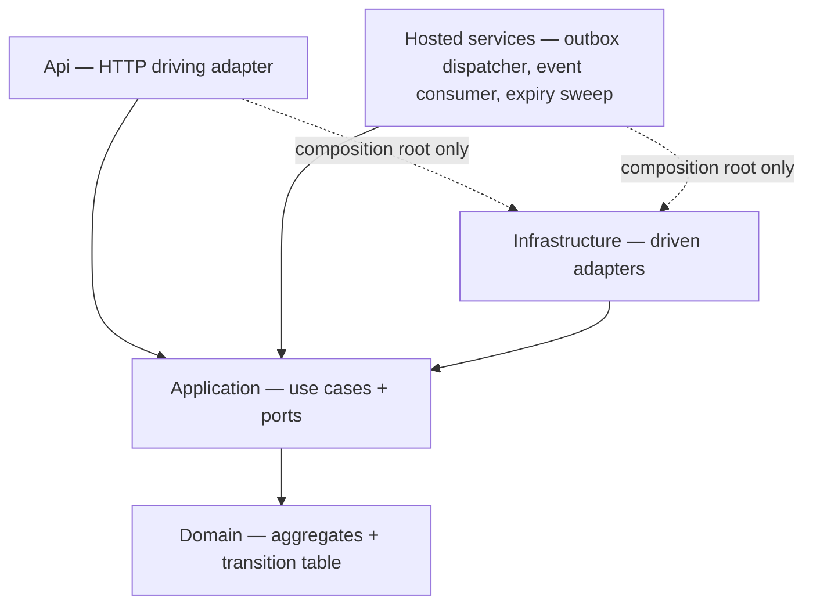
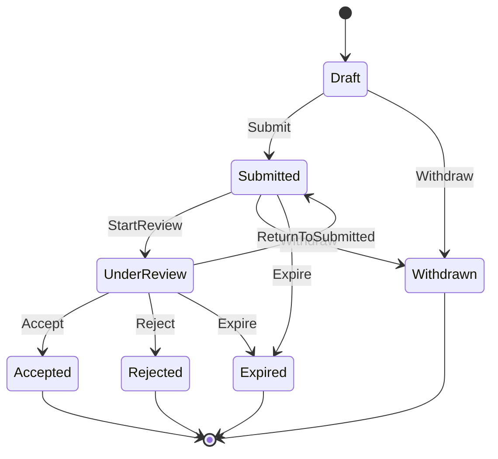
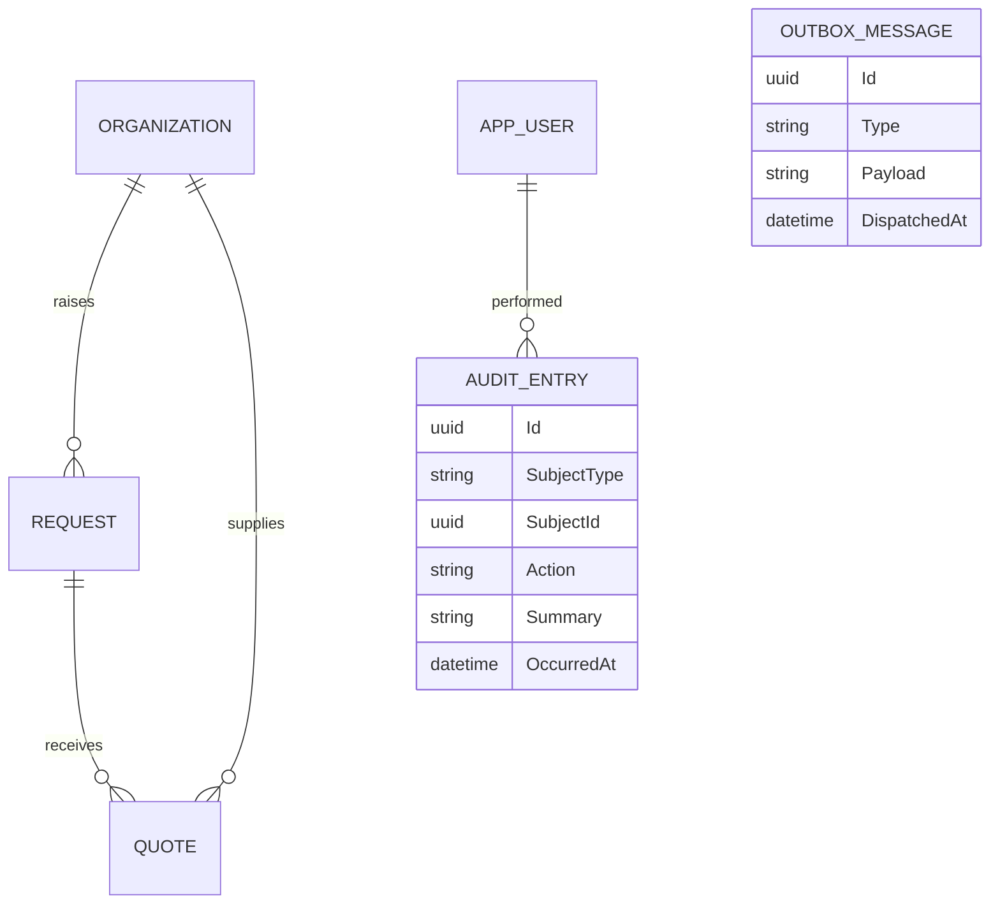
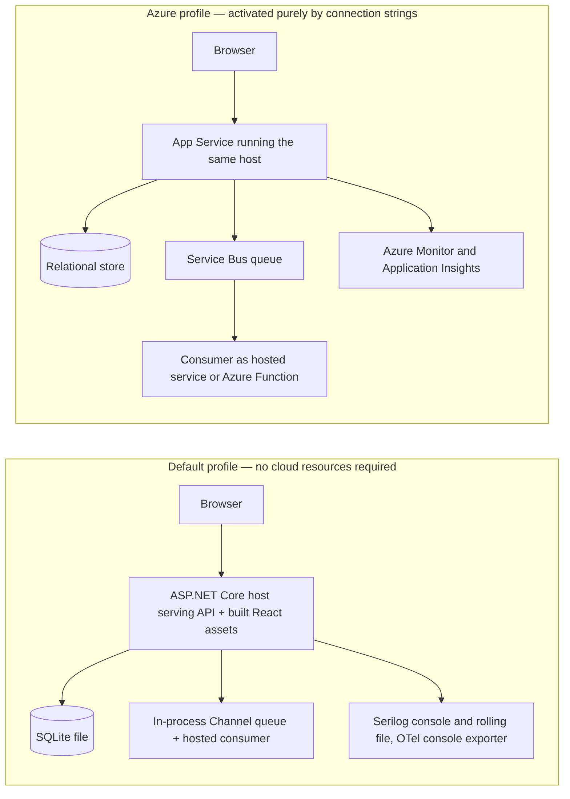

# Architecture Spine — QuoteManager

## Design Paradigm

Modular monolith with **ports and adapters**. One deployable ASP.NET Core host; four projects with an inward-only dependency rule.

| Layer | Project | Owns |
| --- | --- | --- |
| Domain | `QuoteManager.Domain` | Aggregates, the quote transition table, domain events, typed domain exceptions |
| Application | `QuoteManager.Application` | Use-case handlers, outbound **ports**, read-model projections |
| Infrastructure | `QuoteManager.Infrastructure` | Driven adapters — EF Core, outbox dispatcher, messaging, telemetry, clock |
| Api | `QuoteManager.Api` | Driving adapter — HTTP endpoints, auth, error mapping, composition root, hosted services |



The dotted edges are the only permitted outward references, and only from `Program.cs` and the `DependencyInjection` registration files. Everything else resolves ports through the container.

## Invariants & Rules

### AD-1 — Inward-only dependency direction, enforced by package references

- **Binds:** all
- **Prevents:** Domain and Application acquiring framework dependencies, which would make the core untestable and would weld the persistence and messaging choices into the business rules
- **Rule:** `Domain` references no other project and no third-party package. `Application` references only `Domain`, and declares every outbound capability as an interface in `Application/Abstractions`. `Infrastructure` and `Api` reference inward only; nothing references `Api`. No `Microsoft.EntityFrameworkCore.*`, `Microsoft.AspNetCore.*`, `Microsoft.Data.*`, `Azure.*`, `Serilog*`, or `Scalar*` package reference may appear in `Domain` or `Application`. `QuoteManager.Architecture.Tests` asserts this by parsing the **project files**, not the compiled assemblies — Roslyn omits references no code has used yet, so an assembly-level check passes vacuously on a thin project and cannot see a package that was added but not yet called.

### AD-2 — One declarative transition table is the sole authority on the quote lifecycle

- **Binds:** FR-2, FR-3, every quote mutation path
- **Prevents:** transition rules being re-implemented per endpoint or per screen, and the set of transitions the UI offers drifting from the set the API will accept
- **Rule:** A single static table mapping `(QuoteStatus, QuoteAction)` to a resulting `QuoteStatus` lives in `Domain` and is the only place a legal transition is expressed. All mutation flows through `Request.ApplyQuoteAction(quoteId, action, actor, occurredAt)`. The HTTP surface exposes **one** action-driven transition endpoint per quote, never a verb-per-status family of endpoints. An action absent from the table is rejected as a domain violation, never silently ignored.



`Accept` and `Reject` are reachable only from `UnderReview`. Attempting to accept a `Submitted` quote is a real rejection the demo exercises deliberately, not an oversight.

### AD-3 — At most one accepted quote per request, guarded in the aggregate and again at the database

- **Binds:** FR-3
- **Prevents:** two concurrent accept requests each passing an in-memory check and both committing, leaving a request with two accepted quotes and no way to tell which one won
- **Rule:** `Request` is the aggregate root and owns its quotes, so acceptance is a single consistency boundary. `Request.ApplyQuoteAction` refuses `Accept` when any sibling is already `Accepted`. Independently, a filtered unique index on `Quotes(RequestId)` restricted to rows where `Status = 'Accepted'` exists in the schema. Accepting also transitions every sibling in `Submitted` or `UnderReview` to `Rejected` with reason `SupersededByAcceptedQuote`, and sets the parent `Request` to `Awarded`, **all inside one transaction**. A unique-index violation surfaces as HTTP 409 with code `quote.already_accepted`, never as a 500.

### AD-4 — A transactional outbox is the only path by which anything leaves the process

- **Binds:** all domain events, all messaging
- **Prevents:** a committed state change whose event never published (crash between commit and send), and a published event for a transaction that rolled back — the two failure modes that make an event-driven audit trail untrustworthy
- **Rule:** Use-case handlers never call a broker. Aggregates raise domain events; a `SaveChangesAsync` interceptor serialises them into an `OutboxMessages` row inside the same transaction as the state change. One `OutboxDispatcher` hosted service claims unsent rows in insertion order and hands each to the `IIntegrationEventPublisher` port, marking them dispatched only on success. Delivery is therefore **at-least-once**, so every consumer must be idempotent keyed on `OutboxMessage.Id`.

### AD-5 — Audit is a transactional projection of domain events; diagnostic logging is not audit

- **Binds:** FR-5, FR-4
- **Prevents:** the audit trail disagreeing with committed state, and "what happened" being scattered across controllers where each endpoint decides for itself what is worth recording
- **Rule:** Every state-changing operation appends `AuditEntry` rows **in the same transaction** as the change, derived from the same domain events that feed the outbox — so audit cannot be skipped by a code path that forgets to log. Actor identity comes from the authenticated principal only. Serilog and OpenTelemetry output are diagnostics and are explicitly **not** the audit source of truth; audit queries never read log files. The per-request activity timeline that satisfies FR-4 reads `AuditEntry` directly.

### AD-6 — Every outbound dependency has a local default adapter and a configuration-gated cloud adapter

- **Binds:** messaging, telemetry, persistence, notification
- **Prevents:** the demo path and the deployed path being different code, and a missing or unreachable cloud resource turning into a start-up crash
- **Rule:** Each port in `Application/Abstractions` has exactly two implementations: a local one requiring no external service, used by default, and an Azure one selected **only** when its connection string is present in configuration. Selection happens in one composition-root file, never scattered across registrations. The absence of a connection string is a supported, tested configuration — not an exception. Both adapters for a port are verified by the same contract test suite, so the local adapter cannot quietly diverge from the cloud one.

### AD-7 — The client encodes no domain rules; the server projects the permitted action set

- **Binds:** the entire React application, every quote and request response
- **Prevents:** the UI offering an action the API will reject, or hiding a legal one — the single most likely divergence between the two halves of this build, and the one the brief explicitly tests
- **Rule:** Every quote representation crossing the wire carries `permittedActions`, computed server-side from the AD-2 table for the current actor and state. UI controls are rendered by mapping over that array. No TypeScript may branch on `status` to decide what a user may do, and the lifecycle table is never duplicated client-side. Client-side validation is confined to shape and format; every business rule is server-verified.

### AD-8 — Errors cross the boundary as RFC 9457 problem details with a stable machine code

- **Binds:** every endpoint, all UI error handling
- **Prevents:** each endpoint inventing its own error envelope, and the UI string-matching human-readable messages that then break when the wording changes
- **Rule:** One exception-handling middleware maps typed domain exceptions to `ProblemDetails` carrying `type`, `title`, `status`, `detail`, a `code` extension drawn from a closed set of stable identifiers, and the active OpenTelemetry `traceId`. Domain rule violations map to 409, validation failures to 400 with per-field errors, authorisation failures to 403. Controllers and endpoint handlers contain no `try`/`catch` for domain violations. The UI branches on `code` only.

### AD-9 — Stateless JWT bearer authentication with a deny-by-default authorisation fallback

- **Binds:** every endpoint, FR-5 actor capture
- **Prevents:** a mix of auth schemes appearing as the app grows, and a newly added endpoint shipping unprotected because nobody remembered the attribute
- **Rule:** Exactly one authentication scheme: JWT bearer, HS256, signed with a key from configuration. A fallback authorisation policy requires an authenticated user for **every** endpoint, so protection is the default and anonymity is opt-in via explicit `AllowAnonymous` on login and health only. Role gates are declared per endpoint. Password hashing uses the ASP.NET Core Identity `PasswordHasher`, never a hand-rolled scheme. Refresh tokens and revocation are deliberately out of scope for this build and named under Deferred.

### AD-10 — Actor identity comes only from the authenticated principal

- **Binds:** FR-5, every write path
- **Prevents:** a caller attributing an action to another user by putting an actor field in the request body, which would make the whole audit trail inadmissible
- **Rule:** A single `ICurrentUser` port exposes the acting user id, display name, and roles, implemented over `HttpContext.User`. No request DTO may contain an actor, author, or user field; any such field is dropped rather than trusted. Background work that has no HTTP principal supplies an explicit system actor, so an audit row always has a resolvable origin.

### AD-11 — Read models for the work-triage views are dedicated projections, never serialised aggregates

- **Binds:** FR-4
- **Prevents:** the dashboard fanning out into per-row queries as it grows, and presentation concerns leaking back into Domain to make serialisation convenient
- **Rule:** Every list and dashboard endpoint returns a purpose-built DTO produced by a single projected `AsNoTracking` query that selects straight into that DTO. Aggregates are never returned from a controller. Attention signals — quote age, request staleness, proximity to expiry, awaiting-review counts — are computed in the projection or from stored columns, against the injected `TimeProvider` and never `DateTime.Now`, so every signal is deterministic under test.

### AD-12 — Every package version is centrally managed, and known-vulnerable transitives are pinned

- **Binds:** every project in the solution, CI
- **Prevents:** two projects resolving different versions of the same package, and a known-vulnerable transitive dependency shipping because nobody read the restore warnings
- **Rule:** `ManagePackageVersionsCentrally` is on; no `PackageReference` may carry an inline `Version` attribute, and an architecture test fails the build if one appears. `CentralPackageTransitivePinningEnabled` is on so a vulnerable transitive can be raised without making it a direct reference, and every such pin carries a comment naming its advisory and the condition for removing it. CI builds with `-warnaserror`, which promotes NuGet audit findings (`NU1903`) to build failures — so an unpatched advisory cannot merge. Two are pinned today: `Microsoft.OpenApi` to 2.7.5 and `SQLitePCLRaw.lib.e_sqlite3` to 2.1.12, both dragged in by the .NET templates and EF Core respectively.

## Consistency Conventions

| Concern | Convention |
| --- | --- |
| Project and namespace naming | `QuoteManager.<Layer>`; folders by feature inside Application (`Features/Quotes`), by technology inside Infrastructure (`Persistence`, `Messaging`, `Telemetry`) |
| Entities and events | Entities singular PascalCase; EF table names plural; domain events named `<Aggregate><PastTenseVerb>` such as `QuoteAccepted`; ports named `I<Capability>`; adapters named `<Technology><Capability>` such as `ServiceBusIntegrationEventPublisher` |
| Identifiers | `Guid` created with `Guid.CreateVersion7()` in the Domain, never database-generated; UUIDv7 sorts monotonically so it does not fragment the clustered index; serialised lowercase dashed |
| Dates and time | `DateTimeOffset` in UTC everywhere, obtained from the injected `TimeProvider`; ISO 8601 on the wire; `DateTime.Now` and `DateTime.UtcNow` are banned in application and domain code |
| Money | `decimal` mapped to `decimal(18,2)` plus an explicit ISO-4217 currency code column; floating-point types are banned for monetary values |
| HTTP surface | Plural noun resources under `/api`; state changes as `POST /api/requests/{requestId}/quotes/{quoteId}/transitions` with the action in the body; collections always wrapped as an object with `items`, `page`, `pageSize`, `total`, never a bare JSON array |
| Errors | RFC 9457 problem details with a stable `code`, per AD-8 |
| Logging | Serilog structured logging with message templates and named properties, never string interpolation; every entry enriched with trace id and user id; no personally identifying data beyond display name |
| Configuration | Bound to typed options via `IOptions<T>`; `IConfiguration` is read only in the composition root; no secret is ever committed, and the development signing key lives only in `appsettings.Development.json` |
| Validation | FluentValidation at the API edge for shape and format; invariants live in the Domain and throw typed domain exceptions |
| Asynchrony | Every I/O path is async and threads the request `CancellationToken`; `.Result` and `.Wait()` are banned |
| Tests | xUnit v3 with Shouldly assertions and NSubstitute fakes; Domain tests instantiate no infrastructure and touch no database |
| Frontend | Components PascalCase, hooks `use<Thing>`, one generated API client module per resource; server state owned by TanStack Query and never mirrored into component state |

## Stack

Verified against the NuGet flat-container API and the npm registry on 2026-07-28. The code owns this table once it exists.

| Name | Version |
| --- | --- |
| .NET SDK / target framework | `global.json` floor 10.0.100, `rollForward` latestMinor; built and verified on 10.0.301 / `net10.0` (LTS, supported to 2028-11-14) |
| ASP.NET Core | 10.0.10 |
| Entity Framework Core (+ Sqlite, Design) | 10.0.10 |
| SQLite | 3.x via `Microsoft.Data.Sqlite` 10.0.10 |
| Serilog.AspNetCore | 10.0.0 |
| Serilog.Sinks.Console / Serilog.Sinks.File | 6.1.1 / 7.0.0 |
| Azure.Monitor.OpenTelemetry.AspNetCore | 1.6.0 |
| Azure.Messaging.ServiceBus | 7.20.2 |
| Microsoft.AspNetCore.Authentication.JwtBearer | 10.0.10 |
| Microsoft.Extensions.Identity.Core | 10.0.10 |
| Microsoft.AspNetCore.OpenApi | 10.0.10 |
| Scalar.AspNetCore | 2.16.16 |
| FluentValidation (+ DependencyInjectionExtensions) | 12.1.1 |
| xunit.v3 | 3.2.2 |
| Microsoft.NET.Test.Sdk | 18.8.1 |
| Microsoft.AspNetCore.Mvc.Testing | 10.0.10 |
| Shouldly | 4.3.0 |
| NSubstitute | 6.0.0 |
| coverlet.collector | 10.0.1 |
| Microsoft.OpenApi (transitive security pin, GHSA-v5pm-xwqc-g5wc) | 2.7.5 |
| SQLitePCLRaw.lib.e_sqlite3 (transitive security pin, GHSA-2m69-gcr7-jv3q) | 2.1.12 |
| Node.js | 22.18.0 (npm 10.9.3, invoked by absolute path) |
| React / React DOM | 19.2.8 |
| TypeScript | 6.0.3 |
| Vite | 8.1.5 |
| @vitejs/plugin-react | 6.0.4 |
| Mantine (core, hooks, form, dates) | 9.5.0 |
| TanStack Query | 5.101.4 |
| React Router | 8.3.0 |

## Structural Seed

### Core entities



`Organization` fills two distinct roles: a `Request` is raised on behalf of a client organisation, and each `Quote` is supplied by a vendor organisation. `AuditEntry` addresses its subject polymorphically through `SubjectType` plus `SubjectId` so one table covers organisations, requests, and quotes.

### Deployment and operational envelope



The two profiles are the **same build**. Switching is a matter of which connection strings are present, per AD-6. In the default profile the SPA is served as static assets from the API host, so the demo is one process and one URL; Vite's dev server with a proxy is used only during development.

### Source tree

```text
QuoteManager/
  global.json                     # pins the SDK band, rollForward latestMinor
  QuoteManager.sln
  src/
    QuoteManager.Domain/          # aggregates, transition table, domain events, exceptions
    QuoteManager.Application/     # use cases, Abstractions/ (ports), read-model projections
    QuoteManager.Infrastructure/  # Persistence/, Messaging/, Telemetry/, Time/, Identity/
    QuoteManager.Api/             # endpoints, auth, ProblemDetails mapping, hosted services
    QuoteManager.Web/             # Vite + React + TypeScript SPA
  tests/
    QuoteManager.Domain.Tests/          # transition table and invariants, no infrastructure
    QuoteManager.Architecture.Tests/    # asserts the AD-1 dependency rule
    QuoteManager.Api.IntegrationTests/  # WebApplicationFactory over SQLite
  deploy/
    Dockerfile                    # reviewable artifact; the demo never runs it
    compose.yaml
  .github/workflows/ci.yml        # restore, build, test both stacks
  docs/                           # curated deliverables, ADR set, run instructions
```

## Capability → Architecture Map

| Capability / Area | Lives in | Governed by |
| --- | --- | --- |
| FR-1 Manage organisations, requests, quotes | `Application/Features/*`, `Api` endpoints | AD-1, AD-8, AD-9, conventions |
| FR-2 Many quotes per request at differing stages | `Domain.Request` aggregate | AD-2, AD-3 |
| FR-3 Enforced transitions, one accepted quote | `Domain` transition table, EF filtered index | AD-2, AD-3, AD-7, AD-8 |
| FR-4 See what is happening and act on the right work | `Application` read-model projections, dashboard and timeline endpoints | AD-5, AD-7, AD-11 |
| FR-5 Lightweight auditability | `Infrastructure/Persistence` interceptor, `AuditEntry` | AD-4, AD-5, AD-10 |
| Messaging and integration events | `Infrastructure/Messaging`, `OutboxDispatcher` | AD-4, AD-6 |
| Observability and error capture | `Infrastructure/Telemetry`, Serilog, OpenTelemetry | AD-6, AD-8, conventions |
| Authentication and role-based access | `Api` auth pipeline, `Infrastructure/Identity` | AD-9, AD-10 |

## Deferred

| Deferred | Why it can wait | Revisit when |
| --- | --- | --- |
| Refresh tokens, token revocation, lockout | Access tokens with a short lifetime demonstrate the authorisation model; rotation is orthogonal machinery that would consume build time without changing what is being assessed | The tool holds real user accounts |
| Multi-tenancy and row-level authorisation | Organisations are reference data here, not tenancy boundaries; retrofitting is a query-filter change, not a re-architecture | A second customer shares the deployment |
| A second EF provider and SQL Server migration set | Migrations are provider-specific; maintaining two sets is unaffordable inside the timebox, and the provider is isolated behind one registration | The target environment is fixed |
| Horizontal scale-out of the outbox dispatcher | Single-instance ordered draining is correct and simple; competing consumers need row leasing or `SKIP LOCKED`, which SQLite cannot express | More than one API instance runs |
| Real notification transport (email, webhook) | The consumer boundary and idempotency are what matter architecturally; the transport behind the port is substitutable | A stakeholder needs to actually be notified |
| Playwright end-to-end suite | Unit plus integration coverage protects the invariants that carry risk; browser automation is the slowest coverage per hour of build time | Time remains after the demo is rehearsed, starting with one login-to-accept smoke path |
| TypeScript 7 native compiler | GA since 2026-07-08 and roughly ten times faster, but it ships without the stable programmatic API, so typescript-eslint needs a compatibility shim; no payoff on a frontend this small | TypeScript 7.1 ships the new API |
| Azure resource provisioning and CI deployment | Every Azure adapter and the workflow file exist in the repository; provisioning is a subscription-activation task on the critical path of a two-day deadline | The subscription is active and the demo is already rehearsed |
| Performance budgets and load testing | The data volumes here are trivial; AD-11 already prevents the query shape that would fail first | Realistic data volumes exist |
