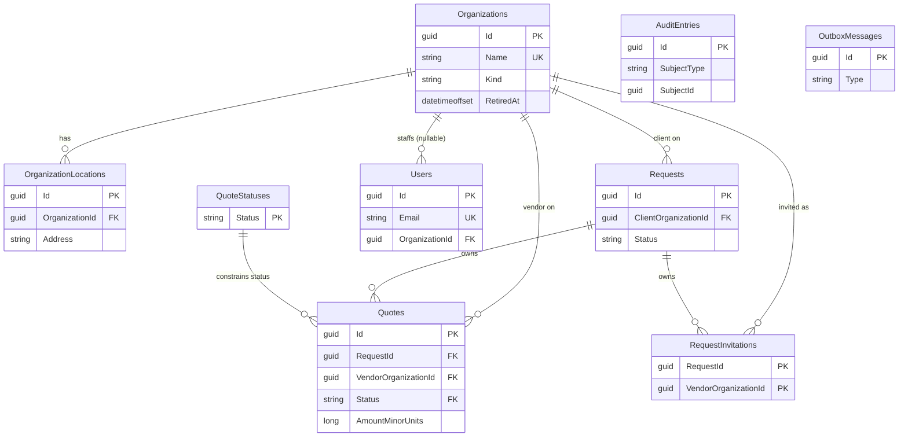

# Database Schema

[← Back to README](../README.md)

SQLite, accessed exclusively through EF Core (`QuoteManagerDbContext`). There is no database
server to configure — the file is created and migrated automatically on first run (see
[README → Configuration](../README.md#configuration)). Every table configuration lives in
`src/QuoteManager.Infrastructure/Persistence/Configurations/`, one file per entity — that's the
source of truth this page is generated from; migrations live alongside it in `Persistence/Migrations/`.

## Entity-relationship overview

`AuditEntries` and `OutboxMessages` are deliberately **not** foreign-keyed to anything — the first
is an append-only projection that must survive even if the row it describes is later gone, and the
second addresses its payload by an opaque `Type` name (an integration event contract, not a row).

## Conventions that apply to every table

- **Primary keys are `Guid`**, generated as UUIDv7 (`Guid.CreateVersion7()`) rather than sequential
  ints or v4 GUIDs — sortable by creation time without a separate timestamp column doing the work,
  which is what lets the activity timeline break ties on `Id` alone.
- **Every `DateTimeOffset` is stored and read back as UTC**, via one EF Core value-conversion
  convention (`UtcDateTimeOffsetConverter`, registered once in `QuoteManagerDbContext.ConfigureConventions`)
  rather than per-property — a column can't reintroduce a non-UTC, unsortable timestamp by
  omission.
- **Aggregate roots carry a `Version` concurrency token** (`Organizations`, `Requests`, `Quotes`) —
  a plain incrementing `int`, not SQLite-incompatible row-versioning, bumped on every state change
  and checked as the `If-Match` header on quote transitions (see
  [API → transitions](api.md#post-apirequestsrequestidquotesquoteidtransitions)). `Users` has no
  such column — last-write-wins on a user edit is an accepted scope cut, not an oversight (see
  [API → Users](api.md#users)).

## Tables

### `Organizations`

The directory of client companies and vendor partners.

| Column | Type | Notes |
| --- | --- | --- |
| `Id` | `guid` PK | |
| `Version` | `int` | Concurrency token |
| `Name` | `string(200)` | Required, **globally unique** (including retired rows) |
| `Kind` | `string(16)` | `Client` \| `Vendor`, immutable after create |
| `CreatedAt` | `datetimeoffset` | |
| `RetiredAt` | `datetimeoffset?` | `null` = active; soft-delete, never hard-deleted |
| `PrimaryAddress` | `string(500)?` | |
| `PrimaryContactName` | `string(200)?` | |
| `PrimaryContactEmail` | `string(320)?` | |
| `PrimaryContactPhone` | `string(50)?` | |
| `IsPreferredVendor` | `bool` | Default `false`; meaningful for `Vendor` rows only, ignored for `Client` |

**Indexes:** unique on `Name`.
**Owns:** `OrganizationLocations` (cascade delete).
**Referenced by** (all `Restrict` on delete — an organization is soft-deleted, never dropped, so
nothing should ever actually try to cascade through it): `Requests.ClientOrganizationId`,
`Quotes.VendorOrganizationId`, `RequestInvitations.VendorOrganizationId`, `Users.OrganizationId`.

### `OrganizationLocations`

Additional sites for an organization, beyond its primary address — owned entirely by the parent
`Organization` aggregate (replaced wholesale on every profile update, never patched piecemeal).

| Column | Type | Notes |
| --- | --- | --- |
| `Id` | `guid` PK | |
| `OrganizationId` | `guid` FK → `Organizations` | Cascade delete |
| `Address` | `string(500)` | Required |
| `Phone` | `string(50)?` | |
| `SortOrder` | `int` | Display order within the parent |
| `Version` | `int` | Present but **not** a concurrency token (unlike the aggregates above) |

**Indexes:** `OrganizationId`.

### `Requests`

A client's request for quotes — the aggregate root that owns its `Quotes` and `RequestInvitations`
(both load and save with it; see `Request.cs`'s note on why the request, not the quote, is the
consistency boundary).

| Column | Type | Notes |
| --- | --- | --- |
| `Id` | `guid` PK | |
| `Version` | `int` | Concurrency token |
| `Title` | `string(200)` | Required |
| `Description` | `string(4000)?` | |
| `ClientOrganizationId` | `guid` FK → `Organizations` | Restrict |
| `Status` | `string(32)` | `Open` \| `Awarded` \| `Cancelled` |
| `NeededBy` | `datetimeoffset?` | |
| `CreatedAt` | `datetimeoffset` | |

**Indexes:** `ClientOrganizationId`, `Status`.
**Owns:** `Quotes`, `RequestInvitations` (both cascade delete).

### `RequestInvitations`

Which vendor organizations were invited to quote on a request — a genuine many-to-many, kept
separate from the request's one-to-many client organization. Exists so silence from an invited
vendor is visible (see [API → Dashboard](api.md#dashboard)'s "awaiting vendor response" projection)
rather than indistinguishable from never having been asked.

| Column | Type | Notes |
| --- | --- | --- |
| `RequestId` | `guid` PK (composite) / FK → `Requests` | |
| `VendorOrganizationId` | `guid` PK (composite) / FK → `Organizations` | Restrict |
| `InvitedAt` | `datetimeoffset` | |

The primary key is the natural composite `(RequestId, VendorOrganizationId)` — a surrogate id
would let the same vendor be invited to the same request twice; the composite key makes the
database itself reject that.

**Indexes:** `VendorOrganizationId` (answers "what has this vendor been invited to?", which the
reverse of the composite key can't serve directly).

### `Quotes`

A vendor's offer against a request. Not an aggregate root itself — every mutating method is
`internal`, reachable only through `Request`, because the "at most one accepted quote per request"
rule needs to see every sibling quote at once.

| Column | Type | Notes |
| --- | --- | --- |
| `Id` | `guid` PK | |
| `Version` | `int` | Concurrency token; this is the value round-tripped as `If-Match` |
| `RequestId` | `guid` FK → `Requests` | Cascade delete (owned by the request) |
| `VendorOrganizationId` | `guid` FK → `Organizations` | Restrict |
| `Status` | `string(32)` | FK → `QuoteStatuses.Status`, restrict — see below |
| `AmountMinorUnits` | `long` | See "Money as integer minor units" below |
| `CurrencyCode` | `string(3)` | ISO-4217 |
| `ExpiresAt` | `datetimeoffset?` | |
| `Notes` | `string(2000)?` | |
| `StatusReason` | `string(200)?` | System-set explanation (e.g. `SupersededByAcceptedQuote`) — distinct from the human-typed `note` on `AuditEntries`, which is never stored on the quote itself |
| `CreatedAt` | `datetimeoffset` | |
| `StatusChangedAt` | `datetimeoffset` | |

**Indexes:**
- `RequestId`, `VendorOrganizationId` (lookup)
- `(Status, ExpiresAt)` composite — the dashboard's two hottest reads (needs-review, expiring-soon)
- **`UX_Quotes_OneAcceptedPerRequest`** — unique, filtered on `Status = 'Accepted'`, over `RequestId`.
  This is the database-level half of "at most one accepted quote per request"; the aggregate
  enforces the same rule in code, so even a race between two concurrent `Accept` attempts can't
  leave two accepted rows.

**Money as integer minor units:** SQLite has no native `decimal` type, and EF's default `TEXT`
storage for `decimal` sorts lexicographically (`"9.00" > "10.00"` as strings), which would silently
corrupt any `ORDER BY amount`. `Amount` is instead converted to `AmountMinorUnits`, an integer
count of the currency's smallest unit (cents), which sorts and compares correctly as a number.

### `QuoteStatuses`

A referenceable lookup table for the set of valid quote statuses — not a business entity, purely
so `Quotes.Status` can be a real foreign key instead of an unconstrained string.

| Column | Type | Notes |
| --- | --- | --- |
| `Status` | `string(32)` PK | `Draft`, `Submitted`, `UnderReview`, `Accepted`, `Rejected`, `Withdrawn`, `Expired` |
| `DisplayOrder` | `int` | |
| `IsTerminal` | `bool` | Whether the lifecycle ends here (no action is ever legal from this status) |

**Seeded in the migration itself** (`HasData`), not the application's demo seeder — `Quotes.Status`'s
foreign key depends on these rows existing before the app has ever started, seed data or not.

### `Users`

Account records for authentication — deliberately **not** a domain aggregate (see
`Infrastructure/Identity/AppUser.cs`'s own doc comment on why: so a password hash can never be
treated as part of a business aggregate). Full behavior in [API → Users](api.md#users).

| Column | Type | Notes |
| --- | --- | --- |
| `Id` | `guid` PK | |
| `Email` | `string(256)` | Required, unique |
| `DisplayName` | `string(200)` | Required |
| `PasswordHash` | `string` | ASP.NET Core Identity `PasswordHasher` output — never plain text |
| `Roles` | `string(128)` | Flags enum stored as its flag names (e.g. `"Requester, Admin"`), not an integer, so the seeded/stored rows stay legible and adding a role can't renumber existing ones |
| `OrganizationId` | `guid?` FK → `Organizations` | Restrict; `null` = platform staff (Admin acting for no organization) |
| `Address` | `string(500)?` | |
| `Phone` | `string(50)?` | |

**Indexes:** unique on `Email`.

### `AuditEntries`

An append-only, transactional projection of domain events — the audit source of truth, never
derived from application logs. Written in the *same* database transaction as the change it
describes (see [Security Overview → Audit trail](security.md#audit-trail)).

| Column | Type | Notes |
| --- | --- | --- |
| `Id` | `guid` PK | |
| `SubjectType` | `string(64)` | `Request` \| `Quote` |
| `SubjectId` | `guid` | Not a foreign key — the entry must survive independently of the row it describes |
| `Action` | `string(64)` | Stable machine name, e.g. `QuoteAccepted` |
| `Summary` | `string(500)` | Machine-generated sentence |
| `ActorId` | `guid` | |
| `ActorDisplayName` | `string(200)` | |
| `OccurredAt` | `datetimeoffset` | |
| `Note` | `string(2000)?` | Free-text explanation the actor optionally typed for this specific event |
| `TraceId` | `string(64)?` | Correlates the row with the diagnostic trace for the same request |

**Indexes:** `(SubjectType, SubjectId, OccurredAt)` — the per-request activity timeline's query;
`OccurredAt` alone — cross-subject recent-activity reads.

### `OutboxMessages`

An integration event awaiting publication, written in the same transaction as the state change it
represents (the transactional-outbox pattern) — not user- or request-facing, purely an
infrastructure concern for reliably publishing to Azure Service Bus when configured (see
[README → Configuration](../README.md#configuration)).

| Column | Type | Notes |
| --- | --- | --- |
| `Id` | `guid` PK | |
| `Type` | `string(200)` | The integration event contract name, dispatched on by a consumer |
| `Payload` | `string` | Serialized event body |
| `OccurredAt` | `datetimeoffset` | |
| `DispatchedAt` | `datetimeoffset?` | `null` = not yet dispatched |
| `Attempts` | `int` | |
| `LastError` | `string(2000)?` | So a permanently-failing message is visible rather than retried silently forever |

**Indexes:** `(DispatchedAt, OccurredAt)` — the dispatcher's only query is "undispatched, oldest
first."

## Migrations

Applied automatically at API startup (`DatabaseInitializer`), in order:

| Migration | Adds |
| --- | --- |
| `InitialSchema` | Core tables: `Organizations`, `Requests`, `Quotes`, `Users` |
| `NormalizeSchemaAndAddInvitations` | `RequestInvitations`, `QuoteStatuses`, referential-integrity fixes |
| `AddOrganizationRetiredAt` | Soft-delete support for organizations |
| `AddOrganizationProfileFields` | Address/contact fields on `Organizations` |
| `AddOrganizationLocationPhone` | `OrganizationLocations` table |
| `AddAuditEntryNote` | `Note` column on `AuditEntries` |
| `AddUserAddressAndPhone` | `Address`/`Phone` columns on `Users` |

To add a new one by hand: `dotnet tool run dotnet-ef migrations add <Name> --project src/QuoteManager.Infrastructure --startup-project src/QuoteManager.Api` (see
[README → Clone and restore](../README.md#clone-and-restore) for the one-time `dotnet tool restore`
this depends on).
